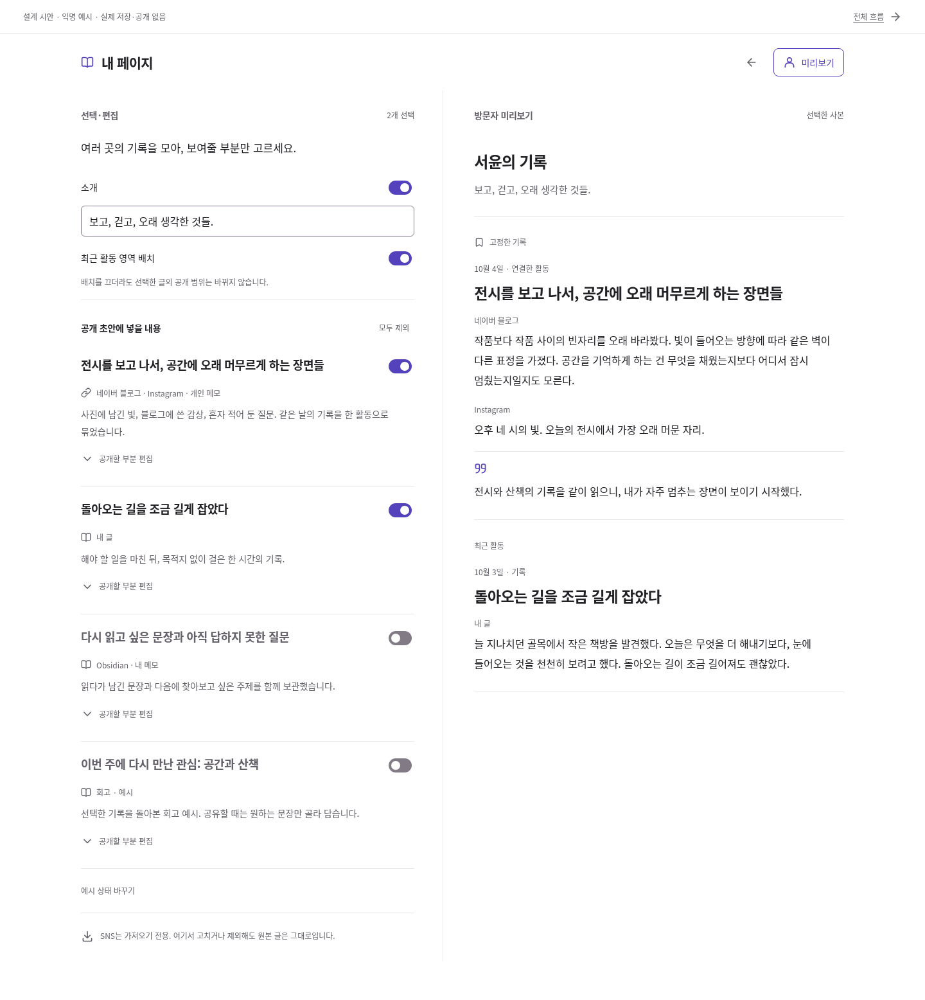
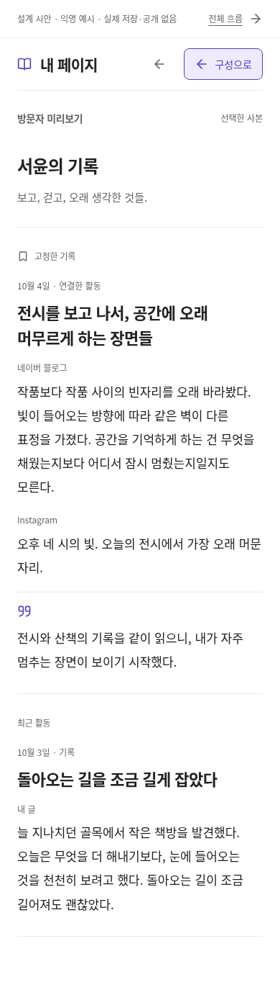

# 흩어진 활동을 모아 내 페이지로

2026-10-05 · 사용자가 통합 방향을 승인하고 SNS 원본의 수정·삭제는 필요 없다고 정했다. **SNS 수신 → 개인 보관·활용 → 선택 편집 → 내 페이지/공유 모음**으로 흐름을 통합한다. 이번 결과는 설계와 독립된 익명 인터랙션 시안이다.

## 시각 자료

- [통합 흐름 SVG](../diagrams/rendered/activity_hub_v4.svg) · [Mermaid 원본](../diagrams/activity_hub_v4.mmd)
- [브라우저용 시안](activity-hub/preview.html): 저장소를 로컬로 열 때 사용하는 HTML이며 운영 페이지 링크가 아니다.
- 아래 캡처는 같은 익명 한국어 자료의 선택·편집과 방문자 미리보기다.

## 같은 활동을 한 번에 보기

가상 인물이 같은 전시를 네이버 블로그 감상·Instagram 글·개인 메모로 기록했다. 활동 단위로 연결하되 보관한 원문은 합치지 않는다. 시안의 기본 공개 초안에는 블로그·Instagram 글과 내 코멘트만 포함되고 개인 메모는 제외된다. 다른 글·메모·회고도 선택하거나 제외할 수 있다.

편집은 Operate, 방문자 화면은 Read 모드다. root가 디자인 책임자로 기존 Life 색·산세리프·간격과 `assets/life/icons.js`의 승인 A 인용 아이콘을 재사용했다. 인스타그램 화면의 외형이나 브랜드 로고를 복제하지 않았다. 기존 기록·도구·관리 탐색을 바꾸지 않고, 기록 안에서 열 수 있는 ‘내 페이지’ 편집 표면을 보여준다.

넓은 화면에서는 편집과 방문자 화면을 나란히 비교하고, 좁은 화면에서는 같은 흐름을 한 열로 읽는다. ‘미리보기’를 누르면 방문자 화면에 집중하고 ‘구성으로’ 돌아올 수 있다. 화면 비교를 위한 상단의 시안 표시는 실제 제품 콘텐츠와 구분한다.

## 해 볼 조작

1. 전시 활동의 ‘공개할 부분 편집’을 펼쳐 Instagram 글을 제외한다. 해당 본문만 미리보기에서 빠지고 다른 글은 남는다.
2. 개인 메모를 포함했다가 끈다. 미리보기의 실제 구성에서 빠지며 CSS로 가리는 동작과 구분된다. 실제 공개 서버의 데이터 권한 검사는 후속 구현이다.
3. 공유용 코멘트를 고친다. 원본 SNS 글은 바뀌지 않는다. 이 시안의 입력은 메모리에만 있고 새로고침하면 초기화된다.
4. ‘최근 활동 영역 배치’를 끈다. 선택은 유지하며 첫 화면의 배치만 바뀐다. 공개 철회 동작이 아니다.
5. 다른 활동을 선택하고 대표 글로 배치한다. 전체 제외로 빈 상태를 보고 ‘예시 선택 초기화’로 복귀한다.
6. ‘예시 상태 바꾸기’에서 첫 사용·확인 중·연결 지연을 비교한다. 연결 지연에도 기존 보관본의 편집·미리보기를 계속 사용할 수 있다.

새 가져오기 기능이나 실제 공개 버튼·URL 복사를 가장하지 않는다. 자동 수집 상태는 화면 예시이며 네트워크 수집기가 아니다. 시안 파일 안에는 모든 익명 예시가 있으므로 이 파일을 운영 개인자료 보호 구현으로 사용하면 안 된다. 게시·갱신·철회에는 선택한 사본만 응답하는 별도 서버 읽기 모델이 필요하다.

## 구현 전에 유지할 판단

- 외부 SNS로 쓰는 경로는 없다. 외부에서 글이 바뀌면 이후 가져오기로 새 버전을 다룰 수 있으나 실시간 수정·삭제 미러링을 약속하지 않는다.
- 기본은 비공개 수집 후 선택 공개다. 시안의 토글은 **공개 초안 편집**이며 이미 게시된 글의 권한을 바꾸지 않는다. 원천/모음의 기본값도 공개 초안의 선택 기준이다.
- 묶음 전체가 자동 공개되지 않으며 타인 본문과 내 글·코멘트를 구분한다. 사진·영상은 이 텍스트 시안에 없고 실제 미디어 저장·권리·용량·백업은 후속 계약이다.
- 소개·대표 글·최근 활동·주제 모음을 선택 구성한다. 주제별 공유 모음, 원천별 기본 규칙과 자동 공개 규칙은 설계이며 이 시안은 대표 활동과 개별 내용 선택에 집중한다.
- 무엇을 공개했는지만으로 개인 관심·성장을 분석하지 않는다. 쉬거나 비공개로 읽는 사용도 완결된 결과다.

## 검증 기록

root가 설계·시안·시각 통합, blog_direction_review가 제품 문서, diagram_contract_review가 수신 전용·공개 경계, mermaid_render가 도식, discovery_report_review가 독립 브라우저 검사를 맡았다. 기존 Impeccable 4.5.0의 프로젝트 지침을 참고했고 별도 디자인 엔진을 실행한 것은 아니다.

| 실제 확인 | 결과 |
| --- | --- |
| 시안 조작·독립 파일 | 16/16 통과. 부분/전체 선택, 실제 미리보기 DOM 제외, 코멘트 문자 이스케이프, 원본 유지, 배치와 선택 구분, 초기화, 상태 전환, 초점, 키보드·터치 모사, reduced-motion, 독립 HTML |
| 화면 크기·상태 | 1440·820·390px × 8상태 = 24장면. 기본 편집·긴 제목·부분 편집·선택 없음·첫 사용·확인 중·연결 지연·방문자 화면 |
| 시각·접근성 측정 | 가로 넘침·44px 미만 조작·이름 없는 조작·16px 미만 입력·잘린 제목 0. 작은 글자 대비 최소 6.05:1, 키보드 초점 3px·7.286:1 |
| 외부·저장 접근 | console/pageerror·외부 요청·fetch·localStorage/IndexedDB·서비스워커 등록 관측 0 |
| Mermaid v4 | 12개 노드·15개 연결, 한글·접근 가능한 제목/설명·라벨 범위 통과. v2/v3 소스·SVG 10개 불변 확인 |
| 프로젝트 정적 검사 | 기존 운영 범위 HTML 16 / JS 34 / 참조 186 / PWA 통과. 시안 조작 검사는 위 별도 검사에서 수행 |

Linux Chromium 151.0.7922.173의 화면 폭·터치 모사다. 실제 Mac·iPad·iPhone의 Files·IME·VoiceOver나 운영 로그인·저장·동기화·공개 권한 검사는 수행하지 않았다. 기존 운영 파일은 바꾸지 않았으므로 앱 회귀를 다시 실행한 것으로 보고하지 않는다.

직접 캡처를 보고 토글의 사각 모서리 노출을 고친 뒤 한 차례 최종 캡처를 갱신했다. 820px의 두 열과 390px의 한 열/미리보기에서 본문과 조작 겹침이 없음을 확인했다. [태블릿 편집](evidence/activity-hub/editor-tablet.png) · [휴대폰 편집](evidence/activity-hub/editor-phone.png) · [넓은 방문자 화면](evidence/activity-hub/visitor-desktop.png)도 함께 볼 수 있다.

재현은 `python3 scripts/dev-server.py --port 4184` 실행 뒤 `node scripts/check-activity-hub-preview.cjs`다. 검사 스크립트는 소스와 공통 CSS·아이콘, 도식과 Lucide 라이선스를 동봉한 `.local/activity-hub/preview-standalone.html`도 만든다. 독립 HTML은 추가 리소스 없이 로컬 HTTP에서 기본 선택·부분 제외를 확인했다. 이 환경의 Chromium이 `file://` 직접 열기를 관리자 정책으로 차단하므로 파일 모드와 실제 Apple 파일 열기는 미검증이다. 정책을 바꾸지 않았으며 초기 검사기의 오류 페이지 탐색 경합은 새 페이지에서 HTTP 검사를 하도록 고쳤다. 세부 보고서·추가 상태 캡처는 `.local/activity-hub/`에 보관한다.
