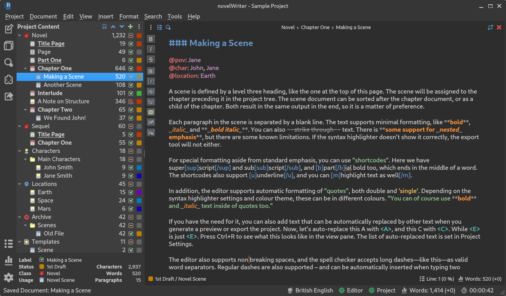
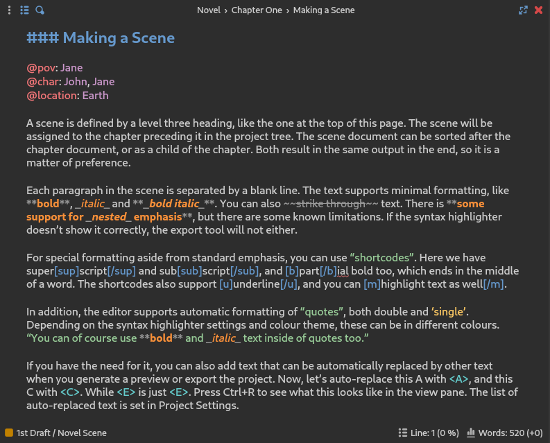
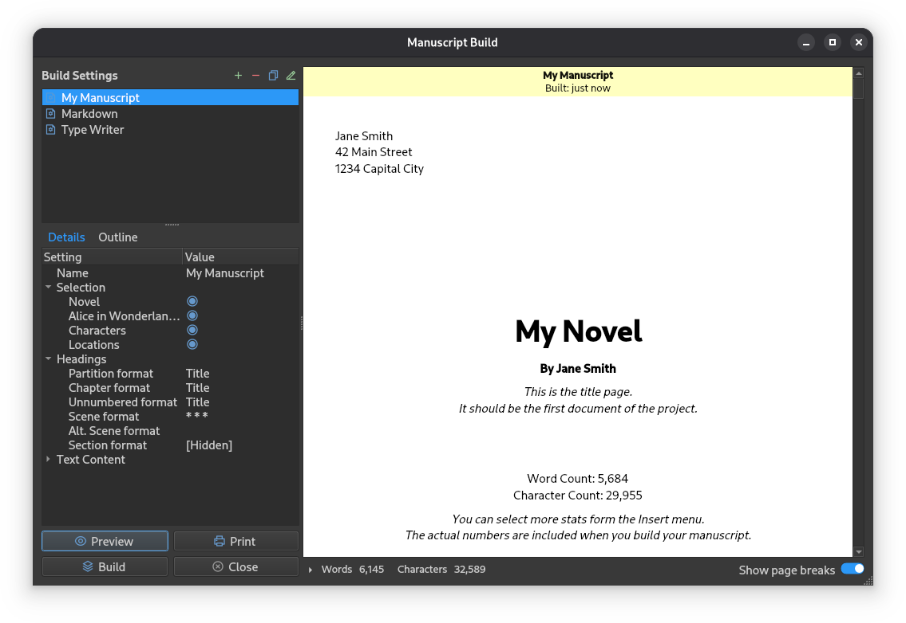
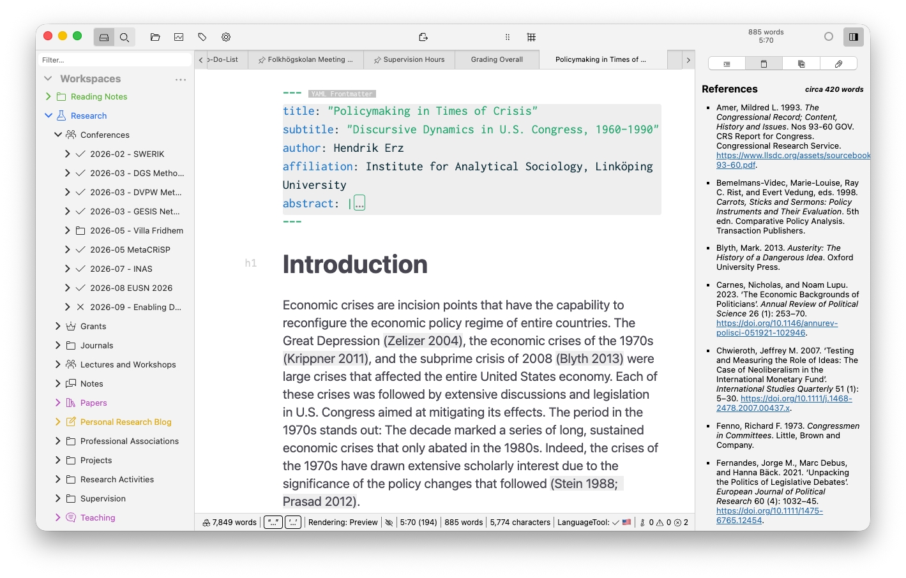
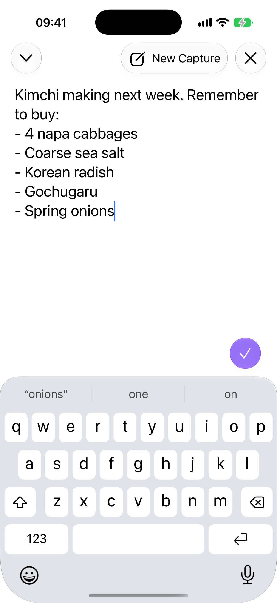
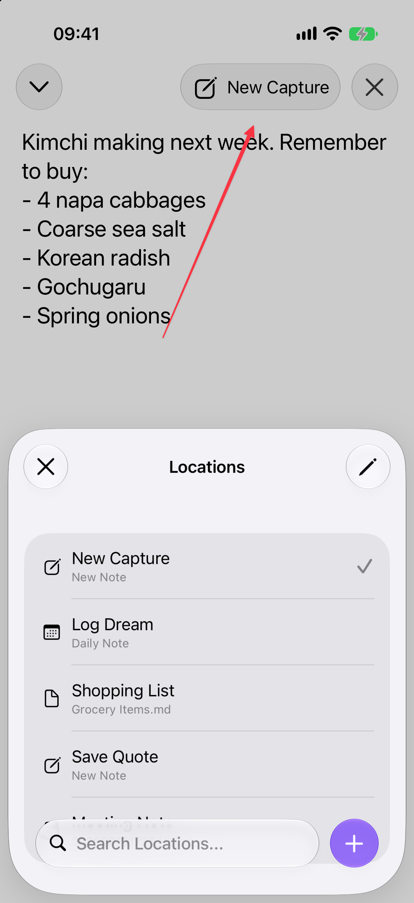

# 책 화면 디자인 리셋 참고 조사

확인일: **2026-10-08 UTC**. 책 목록 → 현재 장 집필 → 전체 읽기의 화면 위계를 정하기 위한 공식 제품 조사다. 기존 OSS 세 제품에 Obsidian 공식 모바일 화면을 추가해 총 네 제품을 비교했다. Obsidian 제품은 proprietary이며 공개 도움말 저장소와 제품 라이선스를 분리한다. 해도에 앱·편집기·의존성을 도입하지 않는다. 운영 코드·저장 모델·SQL은 변경하지 않았다. 디자인 결정과 구현은 단일 디자인 담당자가 통합한다.

공식 GitHub API에서 안정 릴리스, HEAD 커밋, 실제 LICENSE 파일 또는 미확인 상태, 공개 보안 권고를 조회했다. 저장소의 공식 이미지를 내려받아 직접 보았고, 문서·UI 정의를 읽었다. **제품을 설치하거나 조작하지 않았으며**, 반응형·키보드·저장·복귀·Apple 기기 동작은 검증하지 않았다. 공식 이미지가 최신 실행 버전의 화면이라는 주장도 하지 않는다. 고정 커밋 URL, 이미지별 수정 날짜, 원본 파일 SHA-256은 [조회·파일 기록](evidence/book-design-reset/references/manifest.json)에 있다.

## 확인한 제품과 유지보수

| 제품 | 최신 안정 릴리스 / 공개일 | 최신 조회 커밋 / 날짜 | 라이선스·유지보수·확인 범위 |
| --- | --- | --- | --- |
| [novelWriter](https://github.com/saga-soft/novelWriter) | [v26.2.1](https://github.com/saga-soft/novelWriter/releases/tag/v26.2.1), 2026-09-26 | [3ea0240](https://github.com/saga-soft/novelWriter/commit/3ea0240bcca17e214ed772293f1ff932dbfe98a8), 2026-10-07 | GPL-3.0 식별, 실제 [LICENSE 보관](evidence/book-design-reset/references/novelWriter/LICENSE.upstream.txt). 저장소 미보관 상태, 최신 패치와 UI 아이콘 변경 커밋 확인. 공식 이미지 4개·UI 문서 검토. |
| [Zettlr](https://github.com/Zettlr/Zettlr) | [v4.8.0](https://github.com/Zettlr/Zettlr/releases/tag/v4.8.0), 2026-09-18 | [e6c7fd8](https://github.com/Zettlr/Zettlr/commit/e6c7fd8ffebfddb6fa091521b5a9dea673719887), 2026-09-28 | GPL-3.0 식별, 실제 [LICENSE 보관](evidence/book-design-reset/references/Zettlr/LICENSE.upstream.txt). 저장소 미보관 상태, 최근 릴리스·변경 기록 확인. 공식 화면 이미지·README 검토. 브랜드·아이콘은 README에서 별도 권리 보유 명시. |
| [Manuskript](https://github.com/olivierkes/manuskript) | [0.17.0](https://github.com/olivierkes/manuskript/releases/tag/0.17.0), 2025-06-30 | [01e0574](https://github.com/olivierkes/manuskript/commit/01e05747f3c13f637d802ca915c31f9a27a601f8), 2026-09-01 | GPL-3.0 식별, README는 v3 또는 이후 버전 명시. 실제 [COPYING 보관](evidence/book-design-reset/references/manuskript/LICENSE.upstream.txt). 미보관 저장소이며 최근 패키징 수정 확인; 안정 릴리스 간격은 다른 두 제품보다 길다. README·Qt UI 정의·선택 연결 코드를 검토했고 실행 화면은 확인하지 않았다. |
| [Obsidian](https://github.com/obsidianmd/obsidian-help) | [v1.14.4](https://github.com/obsidianmd/obsidian-releases/releases/tag/v1.14.4), 2026-10-05 | 도움말 [4043fa7](https://github.com/obsidianmd/obsidian-help/commit/4043fa7019ea6db47e76e5dcc582740a11683140), 2026-10-08 | 제품 proprietary, 도움말의 재사용 라이선스는 미확인. 공식 도움말/릴리스 저장소 미보관 상태, 최근 업데이트 확인. 공식 iOS Quick Capture 이미지 2개와 모바일·사이드바·읽기/편집 문서 직접 검토. 앱 실행은 하지 않음. |

앞의 OSS 세 제품 공개 권고 API 조회는 모두 성공했다. novelWriter와 Manuskript는 반환 항목이 0개였으며, 이것은 보안 문제가 없다는 증명이 아니다. Zettlr는 [GHSA-qp9r-5xcv-35gx](https://github.com/Zettlr/Zettlr/security/advisories/GHSA-qp9r-5xcv-35gx)(2026-03-30 공개)를 확인했다. 맞춤 내보내기의 shell 실행에 관한 권고이며 API의 영향 버전은 v4.2.0, 패치 버전 필드는 비어 있었다. 최신판의 해결 여부는 이 조사로 확정하지 않는다. 화면 배치만 참고하고 shell/Pandoc 실행이나 해당 코드를 가져오지 않는다. 전체 의존성 보안 감사는 수행하지 않았다.

파일은 공식 연구 근거로만 보관한다. 원본 이미지·코드의 브랜드나 그래픽을 운영 UI에 복사하지 않으며, 재사용 결정이 생기면 개별 자산 조건을 다시 확인한다. 앞의 OSS 세 제품은 라이선스 원문을 각 제품 폴더에 함께 보관했다. Obsidian 도움말은 공개 저장소라는 사실을 라이선스 허가로 해석하지 않으며 아래 별도로 한계를 기록한다.

## 1. novelWriter — 책의 맥락은 남기고 원고를 크게



직접 본 이미지에서는 왼쪽 약 28%가 프로젝트 트리, 오른쪽 약 72%가 원고다. 선택한 장·장면은 트리에서 강조되고, 원고 상단에는 `Novel › Chapter One › Making a Scene`라는 작은 경로가 있다. 본문에 들어가기 전에 제목·질문·기간·관리 폼을 차례로 지나가게 하지 않는다. 트리 아래 상태·단어 수는 원고와 분리되어 있다. 비율은 이 한 데스크톱 이미지에 대한 관찰이며 제품 규격이나 해도의 확정 폭이 아니다.

공식 [main_window.rst](evidence/book-design-reset/references/novelWriter/main_window.rst)는 기본 편집 툴바를 없애고 필요할 때 여는 조작을 설명한다. 오른쪽 문서 뷰어는 원고의 자동 미리보기만을 위한 패널이 아니라 **현재 원고와 다른 메모를 함께 읽는 보조면**이라고 명시한다. Focus Mode에서는 편집기 이외의 UI가 숨겨진다. 이미지의 도구 버튼 열은 열린 상태이므로, 그것을 기본 상시 배치로 잘못 읽지 않는다.



편집기 상세의 상단은 작은 경로와 소수 조작, 아래는 짧은 상태 표시다. 가장 큰 영역은 문장이다. **해도 채택:** 현재 책/장 맥락을 한 줄에서 확인하고 곧바로 장 원고를 읽고 쓰게 한다. 목차는 현재 장 선택이 보이는 별도 맥락이며, 근거·해석·복구 관리는 본문 아래로 몰아 쌓기보다 필요할 때 펼치는 보조 영역으로 구분한다. 장 이동은 입력 보존·IME·저장 실패를 먼저 처리하는 현재 계약을 유지한다.

**해도 제외:** 소설의 인물·장면·장소 트리, 상태색·단어 목표·통계, Markdown 문법 강조, 키워드 자동 치환. 사용자 자료를 자동으로 문법·구조화 텍스트로 바꾸지 않는다. 데스크톱 트리를 작은 모바일 화면의 고정 열로 복제하지 않는다.

### 책 목록과 전체 읽기에서 볼 지점

공식 [Welcome 이미지](evidence/book-design-reset/references/novelWriter/fig_welcome.jpg)는 기존 프로젝트 목록과 새 프로젝트 생성 폼을 각각 보여준다. 기존 프로젝트 행은 이름을 통해 다시 열고, 새 프로젝트의 상세 필드는 별도 생성 화면에 있다. **채택:** 책 목록은 저장한 책을 찾고 여는 일에 집중하고, 새 책 제목·질문·기간 입력을 기존 목록보다 먼저 큰 폼으로 펼치지 않는다. **제외:** 이미지의 큰 삽화, 파일 시스템 경로, 마지막 열기/단어 수를 해도에 없는 데이터로 추정해 넣기.



전체 원고 출력은 별도 창에서 오른쪽의 큰 읽기 영역으로 나타나고, 왼쪽에는 출력 설정/목차가 있다. [manuscript.rst](evidence/book-design-reset/references/novelWriter/manuscript.rst)는 목차 탐색, 출력 포함 선택, 문서 포함과 문서 안 내용 필터의 차이를 따로 설명한다. **채택:** 전체 읽기에서는 이어지는 원고와 장 이동을 우선하고, 출력 옵션은 편집 폼과 분리한다. **제외:** 전체 Build Settings 표, 장별 동적 템플릿과 출력 프로파일 기능 확대. 해도의 현재 Books.project 범위와 명시 본문/해석 옵션을 그대로 쓴다.

이미지별 마지막 변경일은 Welcome·편집기 상세 2025-05-24, 프로젝트·편집 화면 2025-05-25, 출력 미리보기 2026-06-19다. Welcome 안의 표시는 2.3 RC1이며 최신 v26.2.1 화면이 아니다. 2026-10-07 HEAD의 아이콘 변경도 이 이미지에는 반영되어 있다고 볼 수 없다. 이미지의 위계는 공식 문서의 2026년 설명과 함께 참고하고 최신 아이콘 디자인은 복제하지 않는다.

## 2. Zettlr — 원고와 참고문헌은 같은 내용으로 보이지 않는다



직접 본 공식 이미지에는 왼쪽 문서/작업공간 트리, 중앙 원고, 오른쪽 `References`가 각각 다른 영역으로 놓인다. 중앙에는 제목과 문단이 보이고, 오른쪽의 참고문헌은 서지 정보와 URL의 목록이다. 원고 문장과 근거 정보가 한 목록 안에서 같은 크기·형태로 반복되지 않는다. 상단은 문서 탭과 작은 조작, 하단은 별도 상태 줄이다. 이미지의 YAML 메타데이터는 중앙 본문 앞에 노출되어 있다.

**해도 채택:** 장의 원고, 사용자가 쓴 해석/불확실성, exact version 근거를 시각적으로 분리한다. 참고자료를 열어도 어떤 장의 원고를 쓰는지 잃지 않게 한다. 근거 패널이 닫혀 있어도 원문 미확보·누락·타인/미상 관계를 사실과 다르게 숨기지 않는다. 책 제목과 장 제목은 입력 필드인지 읽기 제목인지 구분한다.

**해도 제외:** YAML 메타데이터를 원고 위의 기본 큰 영역으로 놓는 것, 항상 열린 3열, 많은 문서 탭, 색상별 폴더, 학술 인용·서지 형식 변환을 새로 추가하는 것. References 이미지는 서지 관리의 사례이며, 해도의 장근거와 해석의 지지/반대 역할을 자동으로 통합해도 된다는 근거가 아니다. Electron/Vue·Pandoc 도입도 하지 않는다.

공식 README가 이 이미지를 제품 screenshot으로 연결한다. 이미지의 마지막 저장소 변경일은 2026-06-11이며 최신 v4.8.0 실행 화면으로 재촬영하지 않았다. [README 원본 보관](evidence/book-design-reset/references/Zettlr/README.md)과 고정 이미지 URL은 manifest에 있다. 화면상 영문 밀도·서체·수치를 한글 원고에 그대로 적용하지 않는다.

## 3. Manuskript — 구조 정리와 실제 집필은 구분하되 선택 대상을 공유

공식 README는 목차 구성, 장/장면 재배치, 집중 집필을 서로 다른 사용 활동으로 설명한다. README가 연결한 Main view 이미지는 `www.theologeek.ch`의 2017년 이미지다. 이 호스트는 현재 네트워크 허용 목록에 없으므로 요청·우회하지 않았고 **이미지는 보지 않았다**. 대신 GitHub에서 받은 실제 Qt UI 정의와 선택 연결 코드를 직접 읽었다. 아래는 실행 화면이 아니라 그 정의의 구조다.

```text
Outline 탭 (mainWindow.ui:1592)
  수평 splitterOutlineH
    plot tree
    수직 splitterOutlineV
      treeOutlineOutline
      outlineItemEditor

Editor 탭 (mainWindow.ui:1754)
  수직 splitterRedacV
    수평 splitterRedacH
      treeRedacWidget / treeRedacOutline
      mainEditor
      redacMetadata
    storylineView
```

[mainWindow.ui](evidence/book-design-reset/references/manuskript/mainWindow.ui)의 위젯 이름·분할 방향을 그대로 따라 읽었다. [mainWindow.py](evidence/book-design-reset/references/manuskript/mainWindow.py)의 `openIndex`(725행)는 목차의 현재 항목을 지정하고, Editor의 목차 선택 변경은 `redacMetadata`와 `mainEditor` 양쪽으로 연결된다(1428행 `Sync selection`). `openIndexes`는 본문 편집기로 선택 항목을 전달한다. 이 구조는 모음 목록과 원고 편집기가 현재 대상을 공유하되 상세와 문장을 구분하려는 근거다. 크기·색·초점 복귀 품질은 실행하지 않았으므로 평가하지 않는다.

**해도 채택:** 목록/목차에서 선택한 정확한 bookId·chapterId를 집필/전체 읽기의 맥락으로 이어준다. 장을 선택하면 장 원고가 먼저 나오고, 구조 편집은 명시적으로 연 별도 조작으로 둔다. **해도 제외:** 인물·플롯·세계관·스토리라인·요약 단계 등 새 기능, 가로 3영역+하단 4번째 영역을 기본 레이아웃으로 복제하기. 모든 도구를 집필 화면에 넣기 위한 사례로 사용하지 않는다.

UI 정의의 마지막 커밋은 2023-05-14, mainWindow.py는 2025-03-26이다. 2026년 HEAD에 그대로 있는 정의를 읽은 것이며, 최신 전체 실행 형태·가시성·런타임 생성 위젯은 미검증이다. 최근 커밋은 패키징 수정이므로 활발한 UI 개발로 확대 해석하지 않는다. 공식 0.17.0 릴리스도 개발 중 상태와 잦은 백업을 명시한다. 해도 저장·백업 구현의 대체 후보로 추천하지 않는다.

## 4. Obsidian 공식 모바일 화면 — 글은 바로 보이고 보조 선택은 필요할 때

[공식 iOS·iPadOS 도움말](https://github.com/obsidianmd/obsidian-help/blob/4043fa7019ea6db47e76e5dcc582740a11683140/en/Obsidian/Obsidian%20for%20iOS%20and%20iPadOS.md)에 연결된 **Quick Capture** 이미지 두 개를 실제로 보았다. 이는 앱의 전체 책 편집 화면이 아니라 짧은 텍스트 작성·저장 대상 선택 화면이다. 해도의 긴 장 집필을 해결한 제품 사례처럼 확대 해석하지 않는다.




첫 이미지의 상단에는 왼쪽 접기 모양 조작, 가운데 현재 대상 `New Capture`, 오른쪽 닫기 조작만 있다. 그 아래 텍스트가 바로 시작하고, 원고를 둘러싼 큰 카드·진행 통계·설명 폼이 없다. 키보드 위에 저장 체크가 분리되어 있다. 두 번째는 상단 대상 조작을 눌러 연 하단 `Locations` 선택 면이다. 뒤의 텍스트는 남고, 목록에는 제목·짧은 대상 유형·현재 행의 체크가 있다. 보조 정보를 항상 원고 위에 늘어놓지 않고 **지금 고르는 대상과 현재 선택**을 나타낸다. 둥근 조작의 실제 터치 영역·초점·애니메이션은 이미지로만 판단할 수 없다.

**해도 채택:** SNS 작성 화면처럼 짧은 맥락 행 다음에 원고가 바로 나오도록 위계를 단순화한다. 책/장 목차·참고자료를 열 때 현재 책/장 이름과 선택 상태를 분명히 두고, 원고를 다른 폼으로 교체하지 않는다. 선택은 색만으로 나타내지 않고 현재 장의 이름·선택 표시를 함께 보여준다. 넓은 빈 공간 자체보다 본문에 경쟁하지 않는 작은 조작과 보조 정보의 명시적 열기를 참고한다.

**해도 제외:** 큰 pill·시스템 glass 스타일·보라색 원형 체크를 그대로 복제하기, 닫기 버튼을 저장 완료로 추정하기, 새 플로팅 저장 버튼이나 Quick Capture·widgets·native iOS 연동 기능을 추가하기. 해도의 자동 로컬 저장/CAS 상태와 이 제품의 체크를 눌러 확정 저장하는 의미는 다르다. 버튼 아이콘만 줄여 현재 장·저장 실패·정확 버전의 의미를 숨기지 않는다.

공식 [Sidebar 문서](https://github.com/obsidianmd/obsidian-help/blob/4043fa7019ea6db47e76e5dcc582740a11683140/en/User%20interface/Sidebar.md)는 모바일·작은 태블릿에서 보조면을 기본 접고, 큰 태블릿/데스크톱은 확장 아이콘을 쓰는 차이를 명시한다. [Mobile app 문서](https://github.com/obsidianmd/obsidian-help/blob/4043fa7019ea6db47e76e5dcc582740a11683140/en/Getting%20started/Mobile%20app.md)는 편집 도구줄과 비편집 탐색을 구분하며 사용할 수 없는 뒤/앞 조작은 회색으로 표시한다고 설명한다. **채택:** 집필 중에는 현재 장과 쓰기에 필요한 조작, 읽을 때는 목차·편집 복귀에 필요한 조작을 먼저 둔다. **거절:** 스와이프·hover만으로 여는 숨은 제스처와 사용자 맞춤 명령 설정을 새로 추가하기. 해도에서는 명시 버튼, 44px 영역, 키보드 이름·초점 복귀를 유지하며 좁은 화면의 조작 접근은 실제 시안으로 확인한다.

[읽기/편집 문서](https://github.com/obsidianmd/obsidian-help/blob/4043fa7019ea6db47e76e5dcc582740a11683140/en/Editing%20and%20formatting/Views%20and%20editing%20mode.md)는 읽기와 편집을 분리한다. 해도에서는 이 모드 의미만 참고하고 Live Preview·Markdown 편집기를 도입하지 않는다. 전체 읽기에서 해당 장 편집으로 넘어갈 때 같은 원고와 위치를 유지하는 현재 계약이 우선이다.

공식 도움말은 이 Quick Capture가 **Obsidian 1.14 이상 및 iOS/iPadOS 26 이상**에 해당한다고 명시한다. 두 이미지의 마지막 저장소 변경일은 2026-10-05이며 manifest에 기록했다. latest 릴리스 v1.14.4를 직접 실행한 화면으로 주장하지 않는다. native 앱 이미지는 iPad Chrome/PWA의 키보드·하단 안전 영역 동작 증거가 아니다.

**라이선스 구분:** Obsidian 제품은 proprietary 앱으로 취급하며 OSS 의존성 후보가 아니다. 공식 `obsidian-help` 저장소의 LICENSE API는 404이고 README에서도 명시적 재사용 허가를 확인하지 못했다. 따라서 도움말·이미지를 MIT/GPL로 표시하지 않는다. 원본 공식 이미지는 출처를 붙인 조사 근거이며 제품 그래픽·브랜드·코드를 운영 UI로 재사용하지 않는다. 라이선스 조건을 확인해야 하는 실제 도입은 이번 범위에 없다. `obsidian-releases` 공개 권고 API는 항목 0개였으나 닫힌 앱의 보안 감사나 취약점 부재를 뜻하지 않는다.

## 해도에서 시험할 배치와 보존 조건

| 화면 | 이번 참고에서 얻은 최소 배치 | 그대로 유지할 조건 |
| --- | --- | --- |
| 책 목록 | 실제 책 제목이 첫 내용이고 목차는 그 책의 맥락으로 펼친다. 생성·보관·복구는 별도 보조 조작. | 새 복원 ID로 열기, 보관을 삭제로 표시하지 않기, 없는 최근 편집 날짜·완료율 추정 금지. |
| 장 집필 | 작은 책/장 맥락과 장 이동 → 큰 원고 영역 → 필요할 때 여는 근거·해석. 제목/기간/질문 폼을 본문 진입 전 연속 배치하지 않는다. | 현재 textarea DOM·IME·caret 보존, 장 변경 전에 저장 성공 확인, 원문 버전과 사용자 해석/원고를 합치지 않기. |
| 전체 읽기 | 이어지는 장 본문을 크게, 목차/해당 장 편집/출력은 적은 조작으로 구분. | 같은 Books.project 선택 범위, 읽던 위치 복귀, 보관/제외 내용 배제, 원문/해석 포함은 명시 선택, 개인정보와 외부 전송 없음. |

이 배치는 조사에 근거한 **시안 가설**이며 새 레이아웃 확정이나 사용자 검증이 아니다. 데스크톱에서는 원고 폭을 유지할 여유가 있을 때만 목차·근거를 옆에 두는 변형을 비교할 수 있다. iPad 분할/390px에서는 한 번에 원고 한 열을 보이고 목차·참고자료는 명시적으로 열어 돌아오는 방식을 우선 시험한다. 색과 장식은 현재 해도 토큰을 쓰고, 네 제품의 외관을 섞지 않는다.

한글 익명 장 원고와 여러 exact version 근거를 같은 데이터로 놓고, 첫 문단이 보이는 위치·현재 책/장 인식·원문 왕복·전체 읽기에서 편집 후 복귀를 비교한다. 실측 전 행간·폭·열 개수를 제품 성공 규칙으로 확정하지 않는다. 새 기능이나 저장 스키마가 필요한 제안은 이번 리셋 범위에서 제외한다.

## 재현과 근거 사용

- 공식 API: `repos/{owner}/{repo}`, `releases/latest`, `commits?per_page=1`, `license`, `security-advisories`, 고정 HEAD의 `contents/{path}?ref={sha}`, 해당 파일의 마지막 커밋을 조회했다. GitHub의 latest 안정 릴리스 조회 결과이며 출시 일정 예측은 하지 않는다.
- 공식 자산·문서·라이선스의 위치와 SHA-256은 [manifest.json](evidence/book-design-reset/references/manifest.json)에 기록했다. 이 문서에 보이는 이미지는 편집하거나 자른 새 시안이 아닌 원본이다.
- 현재 정책에서 공식 GitHub API 접근을 사용했다. 외부 공식 사이트·차단 호스트를 다른 호스트로 우회하거나 제품을 설치하지 않았다. 자료 조회만 했고 계정·운영 설정은 변경하지 않았다.
- 디자인 참고의 재검토 조건: 실제 한글 시안에서 원고가 늦게 나오거나, 모바일 참고자료 왕복이 현재보다 길어지거나, 입력/위치 보존에 레이아웃 전환이 간섭하는 경우 더 단순한 한 열로 되돌린다. 라이브러리 도입 요청이 생기면 별도 최신·라이선스·보안 확인을 한다.
