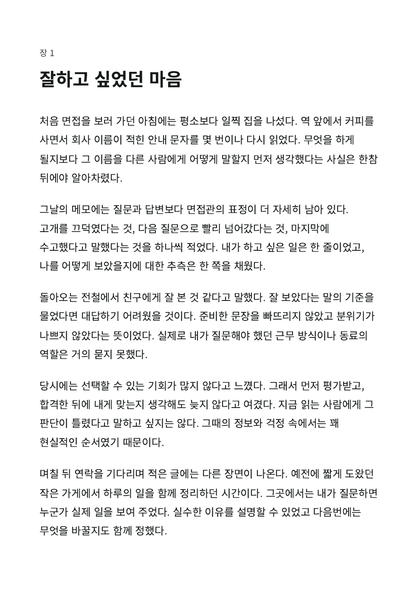

# 초고를 독자용 책자로 읽고 받기

2026-10-08. 선행 [첫 책 작업실](book-workshop.md)의 자료 검토·집필·개정 흐름 위에 독자용 출력을 연결한다. 브랜치 구현이며 병합·배포·운영 SQL은 Local 담당이다.

## 목표와 체험

기존 검토용 PDF는 짧은 원고 사이에 출처 메타데이터와 집필용 해석이 이어져 책처럼 읽기 어려웠다. 기존 검토 출력은 보존하고, **표지 → 목차 → 장 본문 → 출처 부록**의 책자 화면을 추가했다. 전문 출판용 조판이나 자동 공개가 아니다.

`npm run dev` 후 `http://127.0.0.1:4173`에서 공용 로그인 → **도구 → 책 만들기 → 책 열기 → 책자 만들기**로 들어간다. 전체 원고 읽기에서도 같은 화면으로 이동한다. 환경의 기존 공개 인증 설정이 필요하며 별도 비밀번호나 SQL은 추가하지 않는다.

1. 기본 A5 책자를 읽는다. 표지에는 책 제목만 들어가며 목차로 각 장과 출처 부록으로 이동한다.
2. 필요한 경우 A4로 바꾸고 **내 해석·아직 모르는 점 포함**, **연결한 원문 본문 포함**을 각각 고른다. 기본은 모두 꺼짐이다.
3. 고칠 장을 골라 **이 장 고치기**로 편집하고 **책자 다시 보기**로 돌아온다. 저장에 성공해야 이동하며 실패하면 편집 내용을 유지한다. 같은 장은 읽던 위치로, 다른 장은 해당 장 시작으로 돌아온다.
4. **책자 HTML 받기**로 독립 문서를 보관하거나 **인쇄 · PDF**에서 운영체제 인쇄 창을 연다. 실제 쪽나눔·판형·PDF 저장은 인쇄 창에서 확인한다. 화면 미리보기는 본문과 스타일 확인용으로 정확한 페이지 미리보기라고 표시하지 않는다.
5. 파일을 다시 열어 한글 본문·출처·포함 범위를 확인한다. 편집 가능한 복원 사본은 별도의 **관리 → 자료·구성 JSON**이다. HTML/PDF는 백업 형식이 아니다.

## 출력과 보존 계약

- 기존 `Books.project`를 입력으로 `BookPrint.document`가 같은 HTML을 만든다. 기존 검토 출력은 무옵션과 명시적 review/A4/해석포함에서 byte-identical이다. 기존 Markdown도 변경하지 않는다.
- 책자 표지에는 제목만 담는다. 비공개 집필 질문·책 기간을 암묵적으로 표지에 복사하지 않는다. 보관한 책/장과 제외한 해석도 출력하지 않는다. 원고에 직접 적은 개인정보나 해석까지 자동으로 삭제하는 기능은 아니다.
- 장의 정확 원문 출처는 항상 부록에 남긴다. 해석을 선택하면 그 해석·불확실성·근거·반례도 함께 포함한다. 해석만의 원문 참조는 해당 해석이 출력될 때만 부록에 추가한다. 본문 확보/부분/링크·작성자 관계·미확인·없는 버전·옛 버전 식별자를 보존하며 최신 본문으로 대체하지 않는다.
- 옵션과 책자 읽기 위치는 계정/작업공간의 책 화면 세션에만 둔다. 책을 바꾸거나 새로고침하면 초기화한다. 검토용 원문 포함 옵션을 책자로 승계하지 않는다. 저장 스키마·동기화·백업·공개 사본·원문·발췌는 수정하지 않는다.
- 미리보기는 스크립트 없는 sandbox `srcdoc` 문서다. 부모 앱이 생성된 목차의 유효한 `#` 링크에만 `about:srcdoc`을 붙여 프레임 안의 기본 브라우저 이동을 사용한다. 원고·스타일·출처는 같은 HTML이며, 독립 HTML 파일과 Blob 인쇄 문서에는 원래 `#` 링크를 유지한다. 기본 CSP는 외부 요청·스크립트·이미지·외부 글꼴·폼을 허용하지 않는다. 원고를 HTML/Markdown으로 실행하지 않는다.
- 새로 만들기/오류/화면 종료/계정 변경 때 이전 미리보기를 제거한다. 인쇄는 현재 화면·옵션 세대와 글꼴 준비 이후를 재확인하며 취소·afterprint·다음 요청에서 Blob URL을 해제한다. 인쇄 창 요청을 파일 저장 완료로 보고하지 않는다.
- 미리보기 생성 실패는 기존 문서를 숨기고 다운로드·인쇄를 막는다. 같은 설정으로 다시 만들 수 있으며 원고는 바꾸지 않는다. 16 Mi UTF-16 출력 한도와 기존 구성 용량 한도를 구분한다.

## 도구 선택과 시각 기준

[공식 배포·라이선스·브라우저 비교](../life-tools-design/open-source-review.md#독자용-책자-출력--기본-인쇄와-전문-조판의-범위)를 바탕으로 Paged.js·Vivliostyle 대신 기존 native CSS/인쇄 모듈을 재사용했다. 새 의존성·글꼴 다운로드·SQL 없음. 자동 목차 쪽번호·각주·양면 제본 등 요구가 생기면 같은 한글 원고로 조판 엔진을 비교한다.

2026-10-10: Codex 내장 브라우저에서 Blob 프레임이 15초 준비 제한을 넘겨 HTML 받기도 막혔다. 같은 익명 책자·sandbox·CSP로 비교했을 때 `srcdoc`은 즉시 표시됐다. [MDN의 iframe 설명](https://developer.mozilla.org/en-US/docs/Web/HTML/Reference/Elements/iframe)에 따라 `srcdoc`의 상대 URL 기준이 부모 문서임을 고려해 미리보기 목차에만 명시적 `about:srcdoc#…` 목적지를 적용한다. WebKit에서 부모의 클릭 리스너도 sandbox 제약을 받아 상대 링크가 앱 문서를 프레임에 여는 문제가 재현돼, 자식 스크립트나 리스너 없이 기본 링크 이동으로 해결했다. 문서 본문·파일 형식·인쇄 경로는 그대로 유지한다. 검사는 미리보기 목차의 목적지를 별도로 검증한 뒤 이 접두사만 제거해 독립 HTML/인쇄 문서와 전체 DOM을 비교한다. 독립 HTML/PDF의 링크가 손상되거나 격리가 약해지는 경우 선택을 재검토한다.

디자인 책임자는 root 한 명이다. 앱의 공통 흰 바탕·얕은 색 버튼·접힌 포함 범위 설명을 재사용한다. 책 문서는 장 원고를 먼저 읽게 하고 정확 출처를 끝에 모은다. A5/A4의 10.5pt 본문, 1.8 행간, 한글 단어 단위 줄바꿈과 긴 문자열 줄바꿈을 사용한다. 네이티브 인쇄는 폰트/브라우저에 따라 쪽수가 달라질 수 있다.

## 검증 증거

Linux Chromium 151, 실제 동봉 SDK/격리된 IndexedDB와 익명 Auth HTTP로 수행했다. 앱 UI에서 6개 출처/7개 버전과 옛 원문의 발췌를 가져오고 네 장을 직접 써서 검사했다. 실제 개인 자료나 운영 DB는 사용하지 않았다.

| 구분 | 결과 |
| --- | --- |
| 기능 보존 | 정적 검사 18 HTML·58 JS·271 참조/PWA, Node **398/398**. 기존 전체 읽기 **6/6**, 개정·복구·충돌·백업 **7/7**, 검토용 인쇄 **3/3**. [검증 요약과 코드 해시](evidence/book-edition/verification-summary.json) |
| 완결된 사용 흐름 | **5/5**: 1440·820·390px에서 실제 가져오기→네 장 집필→책자→포함 옵션→장 수정·커서/읽던 위치 복귀→파일. 별도 저장 오류·출력 오류·옵션/계정 전환 중 인쇄 취소·빈 책/장. [브라우저 보고서](evidence/book-edition/browser-report.json) |
| 복구 | 수정 전 개정본 1개를 UI로 보관하고 수정 후 JSON을 내려받아 새 작업공간으로 복원. 네 장·수정문장·이전 원고·원문·정확 버전·발췌·제외 해석 보존과 식별자 재매핑 확인. 기존 공간은 덮지 않음 |
| 시각·접근 | 세 폭과 오류/빈 상태 **9개**. 가로 넘침·44px 미달 조작·16px 미만 입력·이름 없는 조작·대비 실패 0, 공통 작은 글자 최저 대비 6.05:1. iframe의 목차 44px·초점·본문 줄바꿈도 별도 확인. 독립 HTML은 viewport 선언을 추가하고 390px Chromium 모바일 모드에서 실제 layout viewport 390px·가로 넘침 없음 확인 |
| 실제 출력 | A5 기본 **12쪽**, A4 해석/원문 포함 **10쪽**. 선택 가능한 한글의 전체 문단, 장 시작·목차 목적지·부록 표제와 첫 출처 동반·짧은 문단/출처 메타데이터의 쪽 분리 방지 확인. 화면·다운로드·native 인쇄 문서 DOM 동일. 820px에서는 실제 인쇄 iframe과 같은 Blob 문서를 별도로 PDF화해 목차 목적지·쪽수·텍스트도 일치 확인 |

예상 밖 외부 요청·콘솔 오류·페이지 오류·운영 쓰기는 0이다. 이 수치는 위 로컬 검증 범위다. 최초 CI의 기존 통합 진입 검사는 실패했고 같은 코드의 [로컬 재검사 13개](evidence/book-edition/unified-home-local-recheck.json)는 통과했다. Cloud 네트워크 정책이 CI 원본 로그 저장소 접근을 차단하여 원인을 확정하지 못했으며, 검사 조건을 바꾸지 않고 GitHub annotation 진단을 추가했다. 최종 CI 상태는 PR #51에서 별도로 확인한다. 최초 실패를 최종 통과로 덮지 않는다. 초기 file/data 주소 열기는 환경 정책으로 차단됐고, 오류 화면을 캡처하는 검사에서 없는 iframe을 기다리던 테스트 문제를 수정했다. 독립 HTML 검사는 다운로드 bytes를 앱 스크립트 없는 별도 localhost 문서로 제공한 후 offline으로 전환했다. **실제 file:// 재열기 성공으로 보고하지 않는다.**

시각 검토에서 본문 앞 조작이 길어 판형·포함 범위·장 이동을 접었다. PDF에서는 과도한 출처 연결 규칙 때문에 부록 제목이 혼자 한 쪽에 남고 메타데이터가 갈라졌으며, 짧은 문단의 마지막 한 줄도 다음 쪽으로 넘어갔다. 출처의 다음 요소 강제 연결을 풀고 짧은 문단은 가능한 한 묶어 출력하도록 수정한 뒤 위 결과를 재검증했다. 매우 긴 문단/출처는 한 쪽보다 길면 브라우저가 나눌 수 있다.

### 바로 확인할 결과물

- [A5 책자 PDF · 12쪽](evidence/book-edition/book-a5-820.pdf) / [같은 독립 HTML](evidence/book-edition/book-a5-820.html): 원고·출처 부록, 해석과 원문 본문은 제외.
- [A4 PDF · 10쪽](evidence/book-edition/book-a4-820.pdf) / [같은 HTML](evidence/book-edition/book-a4-820.html): 해석·불확실성·원문 본문을 명시 포함.
- [수정한 A4 PDF](evidence/book-edition/book-a4-820-revised.pdf): 둘째 장 수정 반영, 해석 포함·원문 본문 제외.
- [익명 네 장 복원용 JSON](evidence/book-edition/reader-book-backup.json): **관리 → 자료·구성 백업 → 새 사본 복원 → 도구 → 책 만들기**에서 직접 편집한다. PDF/HTML과 달리 책·개정본·원문을 복원하는 파일이다.

[1440px](evidence/book-edition/booklet-default-1440.png) · [820px](evidence/book-edition/booklet-default-820.png) · [390px](evidence/book-edition/booklet-default-390.png) · [포함 옵션](evidence/book-edition/booklet-options-390.png) · [출력 오류](evidence/book-edition/render-error-390.png) · [표지](evidence/book-edition/a5-cover.png) · [목차](evidence/book-edition/a5-contents.png) · [출처 부록](evidence/book-edition/a5-appendix.png)

실제 Apple 기기·개인 원고·한글 IME·Files·OS 인쇄 창에서 PDF 저장은 미검증이다. 자동 목차 쪽번호·쪽번호 여백 영역·양면 제본 배열·도련·출판용 서체 포함·접근성 태그 PDF는 구현하지 않았다. 화면 폭 검사를 실제 기기 사용성으로, 생성 PDF를 사용자 저장 완료로 대신하지 않는다.

## Local 인계

1. 선행 #50과 그 기반 PR의 현재 병합 상태부터 확인한다. 이번 변경은 #50 위에 적용한다. Cloud는 main 병합·공개 배포·운영 SQL을 실행하지 않는다.
2. 이번 변경의 신규 SQL은 없다. 선행 책·해석·개정본 validator의 운영 조건은 [#49 인계](book-recovery-print.md#local-인계)를 따른다. 이미 설치한 SQL은 다시 적용하지 않으며 최신 editions validator 이후 과거 validator로 되돌리지 않는다.
3. 최종 CI·`npm run check`·`npm test`·`node tests/book-edition-browser.cjs`와 증거를 확인한다. 브라우저 검사는 격리된 익명 Auth HTTP와 실제 SDK/IndexedDB로 실행하며 운영 합성 자료를 만들지 않는다.
4. 배포 후 캐시 `haedo-v84`, 실제 로그인·기존 책·편집 저장·책자 HTML 재열기·PDF 저장을 Mac/iPad Chrome/iPhone에서 확인한다. 실제 Apple 기기·개인 원고·IME·Files·OS 인쇄 저장 성공은 Cloud 검증과 별도다.

다음 우선순위는 **본인 원고 한 권을 실제 기기에서 읽고 수정·출력 → 읽기/개정 중 반복되는 불편 개선 → 필요한 경우 자동 목차 쪽번호·각주 등 정밀 조판**이다. 자동 AI 해석·SNS 연결·자동 공개는 이번 범위에 추가하지 않았다.
