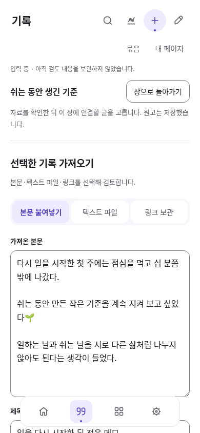
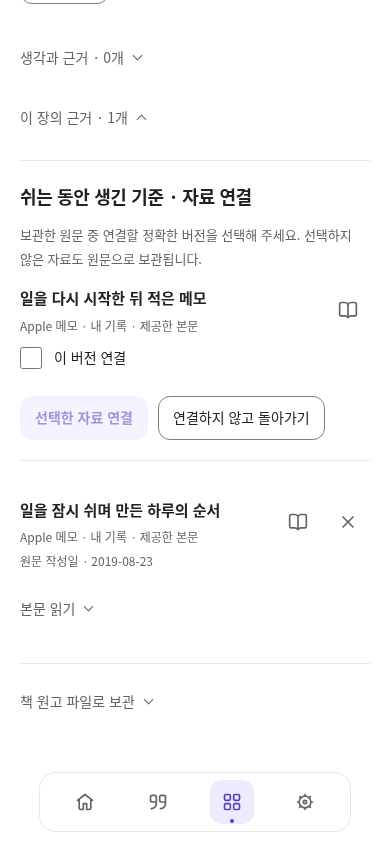
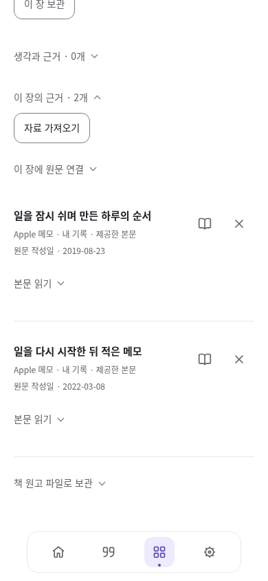

# 집필 중 자료를 가져와 같은 장에 연결하기

2026-10-08. 선행 PR #52의 책 재진입 위에 장별 가져오기 왕복을 연결한다. 브랜치 구현이며 병합·배포·운영 SQL은 Local 담당이다.

## 목표와 실제 흐름

장 근거에서 필요한 원문을 못 찾으면 기록의 일반 가져오기로 나가야 했고, 보관 후에는 원래 책과 장을 다시 찾아야 했다. 기존 가져오기·검토·원문 저장과 책의 정확 버전 연결을 재사용해 **장 편집 → 자료 가져오기 → 원문·출처 검토 → 자료 보관 → 연결할 버전 선택 → 같은 장 편집**으로 이어진다.

1. 홈 → 내 책 → 목차에서 장을 열고 **이 장의 근거 → 자료 가져오기**를 누른다. 원고 저장에 성공해야 이동한다. 이전 가져오기 초안도 먼저 보관한 뒤 새 검토를 시작한다.
2. 가져오기 상단에 시작한 장과 복귀 버튼이 표시된다. 본문 붙여넣기·TXT/Markdown 파일·링크와 기존 출처/발췌 검토를 그대로 사용한다. 입력만 한 채 돌아가면 검토 초안으로 보관하고 장에는 연결하지 않는다.
3. 단일 자료를 보관하면 시작한 장의 연결 검토로 돌아온다. 여러 파일은 각각 검토한 뒤 **보관한 자료 확인**으로 돌아온다. 미확정·실패 파일은 후보에 넣지 않는다.
4. **후보는 기본 미선택**이다. 원문을 열어 정확 버전을 확인한 뒤 원하는 것만 체크하고 **선택한 자료 연결**을 누른다. **연결하지 않고 돌아가기**는 장을 바꾸지 않으며 이미 보관한 원문을 삭제하지 않는다.
5. 장 저장에 성공하면 같은 원고와 커서 위치로 돌아온다. 기존 전체 읽기·책자·Markdown 출력과 백업을 계속 사용한다. 원문 본문을 파일에 넣는 옵션은 기존처럼 별도 선택이다.

## 보존 계약과 구현 선택

- 원문 저장과 장 구성 저장은 **별도 트랜잭션**이다. 원문 보관 성공을 장 연결 성공으로 표시하지 않는다. 장 저장 실패 때 원문·현재 원고·선택을 보존하고 같은 연결을 재시도한다. 중복 참조는 추가하지 않는다.
- 저장이 확인된 가져오기 결과의 정확 `sourceVersionId`만 후보로 사용한다. 중복 가져오기가 과거 버전을 재사용하면 그 버전을 유지한다. 최신 버전으로 대체하거나 타인의 원문을 장 원고에 복사하지 않는다.
- 원문 저장 후 목록 읽기가 실패해도 이미 성공한 원문을 다시 적용하지 않는다. 기존 optional `appliedResult` 계약을 단일 장 가져오기에도 재사용한다. 원문을 지우며 부분 성공을 되돌리지 않는다.
- 연결 직전에 현재 작업공간·책·그 책의 장·보관 상태·정확 원문 존재·장/전체 구성 한도를 확인한다. 기존 구성 CAS·충돌 비교·복구 사본 계약을 유지한다. 일반 원문·발췌·해석·개정본·동기화·백업·공개 사본 형식은 바꾸지 않는다.
- 장 연결 대상과 후보 선택은 현재 화면 세션의 상태다. 새로고침·계정/작업공간 변경 때 초기화한다. 가져오기 도중 일반 탐색으로 나가면 자동 장 복귀 대상은 해제하며, 이미 장에 돌아온 연결 후보는 같은 작업공간의 화면 세션에서 유지한다. 이미 보관한 원문과 검토 초안은 기존 저장 규칙대로 남으며, 이후 장의 **이 장에 원문 연결**에서 다시 고를 수 있다. 새 저장본을 명시적으로 읽으면 승인하지 않은 후보는 폐기한다. 기기 간 연결 예약/자동 연결 기능이 아니다.
- 새 의존성·SQL·저장 스키마를 추가하지 않았다. 기존 stage/receipt, Workbench 검증·CAS와 공통 버튼·체크박스·sourceRow를 재사용한다. [기존 오픈소스 비교와 재사용 판단](../life-tools-design/open-source-review.md)을 유지하며 외부 편집기나 가져오기 엔진은 이번 탐색 연결 문제를 해결하지 못하므로 도입하지 않는다.

디자인 책임자는 root 한 명이다. 흰 본문·얕은 색 조작·같은 아이콘을 유지한다. 연결 검토 중에는 다른 가져오기/원문 선택기를 숨겨 선택 동작을 중복 노출하지 않는다. 대상 장 이름, 원문 작성자 관계·확보 범위, 명시 선택과 취소를 우선 표시한다.

## 검증과 화면

Linux Chromium 151, 격리된 익명 Auth HTTP와 실제 SDK·IndexedDB로 검사했다. 실제 개인 자료·운영 DB·외부 SNS를 사용하지 않았다.

- 정적 검사 HTML 18/JS 58/참조 271/PWA 및 Node **398/398** 통과.
- [최종 새 흐름 7/7](evidence/book-import-return/browser-report.json): 1440·820·390px에서 실제 네 장 백업 복원 → 둘째 장에서 가져오기 → 정확 발췌/출처 저장 → 기본 미선택 후보 → 명시 연결 → 같은 원고/caret 복귀 → 원문 왕복 → Markdown 포함 범위. 기존 버전 중복 재사용/취소/반복 연결, 이전·현재 검토 초안 보존, 원고 저장/장 연결 실패·재시도, 배치 두 글 중 한 글 연결·계정 전환도 포함한다.
- [실패·지연·충돌 복구 6/6](evidence/book-import-return/recovery-report.json): 원문 commit 성공 직후 목록 읽기 실패를 주입해도 원문과 commit이 각 1회만 증가한다. 재확인 후 명시 연결이 가능하다. 늦은 응답은 다른 화면·장·로그아웃 뒤 새 검토를 열지 않으며, 보관된 장은 다른 장으로 대체하지 않는다. CAS 충돌은 로컬 원고와 선택을 보존하고 비교 후 명시 적용·재시도로 복구한다.
- 기존 배치 가져오기 **8/8**, 가져오기·발췌 3폭 **3/3**, [재가져오기 7/7](evidence/book-import-return/reimport-regression.json) 통과. 기존 source/version/record 컬렉션과 장 원고·개정본·발췌 좌표를 대조했다. 중복 가져오기도 정상 commit에 따라 작업공간 revision은 증가할 수 있다.
- 신규 시각 상태 **13개**에서 가로 넘침·44px 미만 조작·16px 미만 입력·이름 없는 조작·대비 실패 0, 작은 글자 최저 대비 6.05:1. 세 폭의 실제 화면도 직접 열어 검토했다. 첫 시각 검토에서 390px 본문 입력이 아래에 밀려 있어, 장에서 시작한 폼은 본문/파일 → 출처 정보 순서로 고친 뒤 최종 전체 흐름을 다시 통과했다. 일반 가져오기의 기존 순서는 유지한다.

콘솔·페이지 오류·예상 밖 외부 요청·운영 쓰기 0. 신규 테스트 초기에 Markdown이 UUID도 출력한다는 기대와 중복 commit의 작업공간 revision까지 불변이라는 기대가 잘못돼 실패했다. 기존 exporter/commit 계약을 확인해 실제 보존 대상(정확 버전/출처·본문 포함 범위, 원문 컬렉션과 장 참조)으로 수정했고 [실행 이력](evidence/book-import-return/combined-report.json)에 구분했다. 앱 저장 결함을 검사 조건 완화로 숨긴 사례가 아니다.

[820px 가져오기](evidence/book-import-return/targeted-import-820.png) · [1440px 가져오기](evidence/book-import-return/targeted-import-1440.png) · [저장 오류](evidence/book-import-return/link-save-error-390.png) · [개선 전 장 근거](evidence/book-import-return/before-chapter-sources-390-viewport.png)

실제 Apple 기기·개인 기록·한글 IME·Files·OS 인쇄 저장은 미검증이다. 이번 출력 확인은 기존 Markdown의 정확 출처·선택 본문 포함 범위이며 PDF 조판을 바꾼 작업이 아니다. 브라우저 화면 크기·터치 모사를 실기 사용성으로 보고하지 않는다.

## Local 인계

1. 선행 #52 및 기반 PR의 현재 병합 상태를 확인한 뒤 이번 변경을 적용한다. Cloud는 병합·배포·운영 SQL을 실행하지 않았다.
2. 신규 SQL 없음. 선행 책·해석·개정본 validator의 운영 조건은 [책자 인계](book-edition.md#local-인계)를 따른다. 이미 설치한 migration을 반복하거나 최신 validator를 과거 정의로 덮지 않는다.
3. 최종 CI와 `npm run check`, `npm test`, `node tests/book-import-browser.cjs`, `node tests/book-import-recovery-browser.cjs`를 확인한다. 익명 모의 Auth와 실제 SDK·IndexedDB의 로컬 검사이며 운영 합성 자료를 생성하지 않는다.
4. 배포 후 캐시 `haedo-v86`, 실제 로그인 → 기존 장 원고 수정 → 자료 가져오기 → 명시 연결/취소 → 원문 대조 → 책자 출력을 확인한다. 실제 Mac/iPad/iPhone·IME·Files·OS 인쇄 저장은 별도 확인이 필요하다.

다음 우선순위는 **복원 직후 책으로 안내 → 실제 개인 원고와 Apple 기기에서 가져오기·수정·파일 보관 체험 → 발견한 반복 불편 개선**이다. SNS 자동 연결·외부 AI 전송·자동 공개는 이번 범위에 포함하지 않았다.
