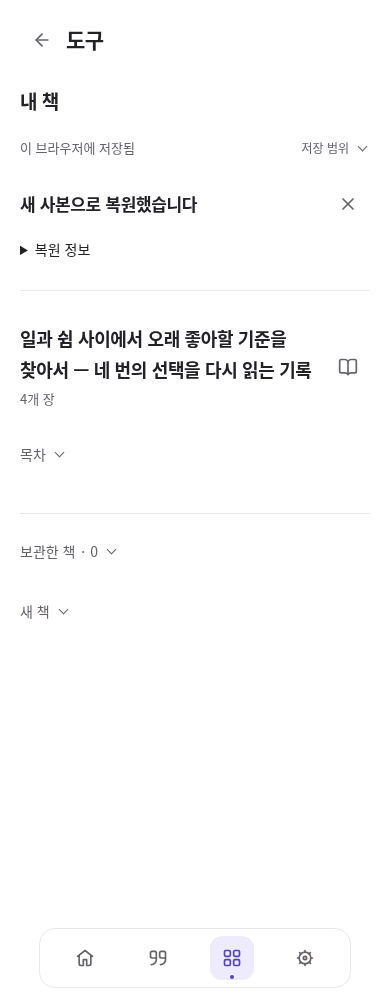

# 백업 복원 후 책으로 이어가기

2026-10-08. 선행 #53의 장별 가져오기 위에 복원 후 책 진입을 연결한다. 브랜치 구현이며 병합·배포·운영 SQL은 Local 담당이다.

## 문제와 체험 경로

책이 들어 있는 통합 백업도 복원 직후 빈 ‘내 페이지’로 이동했다. 사용자는 책이 복원됐는지 확인하기 위해 홈이나 도구를 다시 찾아야 했다. 이제 복원된 새 작업공간에 책이 있으면 **내 책 목록**을 연다. 특정 책·장을 임의로 고르거나 보관한 책을 자동 복구하지 않는다.

**관리 → 자료·구성 백업 → JSON 선택 → 복원 전 확인 → 새 사본으로 복원 → 책 제목·목차 확인 → 원하는 장 편집 → 원문 대조 → 책자 만들기·파일 받기**가 이번 체험 경로다. 실제 익명 네 장 백업은 [기존 샘플](evidence/book-edition/reader-book-backup.json)을 사용한다.

- 책이 여러 권이면 복원된 책 목록에서 고른다. 제목이 같더라도 복원된 새 book/chapter ID로 구분하며 옛 ID나 제목 추정으로 이동하지 않는다.
- 책이 모두 보관 상태이면 보관한 책을 펼친다. ‘책 복구’를 직접 누르기 전에는 보관 상태가 유지된다. 새 책 입력은 접는다.
- 책이 없는 기존 통합 백업은 기존 내 페이지 경로를 유지한다. 원문 전용 JSON은 기존 자료 목록 복원 경로를 유지한다.
- 복원 안내의 ‘복원 정보’에서 이전 작업공간으로 돌아갈 수 있다. 책을 열면 안내가 본문 앞에 남지 않는다. 안내 닫기는 책 목록으로 초점을 돌린다.
- 안내는 현재 화면 세션에만 있다. 새로고침 후에도 책은 저장돼 있지만 복원 안내를 영속 이력처럼 재생하지 않는다. 다른 작업공간은 관리에서 선택한다. 백업에 없는 과거 커서나 읽던 위치를 복원했다고 표시하지 않는다.

## 보존과 실패 처리

기존 `Workbench.restoreBackup`의 ID 재매핑과 `Storage.installWorkbenchCopy`의 bundle·구성·소유자·활성 작업공간 원자 저장을 그대로 사용한다. 원문·정확 버전·발췌 좌표·개정본·장 보관·해석 제외를 바꾸지 않는다. 새 저장 형식·라이브러리·SQL·원격 연결·공개는 추가하지 않았다. [기존 오픈소스 검토](../life-tools-design/open-source-review.md)의 공통 컴포넌트·IndexedDB 재사용 판단을 유지한다. 이 문제는 복원 결과와 기존 책 목록의 연결 문제이므로 새 복원 엔진이나 라우터가 필요하지 않다.

원자 저장이 성공하면 새 사본 화면을 먼저 연다. 이후 작업공간 목록 갱신이 실패해도 저장 실패로 안내하거나 같은 사본의 설치 버튼을 다시 내놓지 않는다. 책 구성 읽기 실패는 저장 완료 안내와 기존 ‘다시 불러오기’로 구분한다. 화면 재시도는 읽기만 수행한다.

복원 후 비동기 렌더·목록 조회는 작업공간·탐색 세대와 현재 화면을 확인한다. 다른 화면·작업공간·계정으로 이동한 뒤 옛 응답이 초점을 가져오거나 복원 안내를 다시 끼워 넣지 않도록 렌더 순번도 확인한다. 입력·저장 실패 때 이동을 막는 기존 규칙은 유지한다.

디자인 책임자는 root 한 명이다. 기존 책 목록·목차·아이콘·본문 스타일을 재사용하고, 복원 안내의 반복 구분선을 줄였다. 이미 책이 있으면 목록 제목은 ‘책 만들기’ 대신 ‘내 책’이다.

## 검증 증거

정적 검사 HTML 18/JS 58/참조 271/PWA, Node 398/398, 집중 흐름 7/7과 기존 통합 백업 회귀 17/17을 통과했다. 세 화면 폭을 포함한 신규 시각 상태 8개에서 가로 넘침·44px 미만 조작·16px 미만 입력·이름 없는 조작·대비 실패는 0이고, 작은 글자 최저 대비는 6.05:1이었다. 콘솔·페이지 오류·예상 밖 외부 요청·운영 쓰기는 0이다. 최종 UI를 직접 열어 확인했으며, 처음 발견한 부적절한 ‘책 만들기’ 제목과 반복 구분선을 한 번에 정리한 뒤 집중 검사를 다시 통과했다. 최종 커밋 전체 CI는 PR에서 별도로 확인한다.

검증 결과와 최종 화면은 아래 증거 파일에 보관한다. 익명 모의 Auth와 실제 동봉 SDK·IndexedDB를 사용하며 운영 계정·개인 자료·운영 SQL에 접근하지 않는다.

- [집중 브라우저 검증](evidence/book-restore-entry/browser-report.json): 복원한 책 선택·장 편집·정확 원문 왕복·출력, 다중/보관/책 없음 분기, 설치 실패 재시도, 저장 후 조회 실패, 늦은 응답과 계정 분리.
- [기존 통합 백업 회귀](evidence/book-restore-entry/workbench-regression.json): 책이 없는 기존 구성 복원·원문/발췌·이전 작업공간·저장 실패 보존.
- [출력한 익명 책자 PDF](evidence/book-restore-entry/restored-edited-book.pdf): 복원한 장을 수정한 뒤 내려받은 HTML을 Chromium으로 PDF 출력하고 한글 텍스트·제외 범위를 확인한다. 실제 OS 인쇄 저장 검사가 아니다. A5 12쪽, 한글 원고 텍스트 추출을 확인했고 출력 5·7쪽을 직접 검토했다. [수정 문장이 포함된 7쪽](evidence/book-restore-entry/restored-edited-book-page7.png)도 보관한다.

[1440px](evidence/book-restore-entry/restored-books-1440.png) · [820px](evidence/book-restore-entry/restored-books-820.png) · [보관한 책만 있는 사본](evidence/book-restore-entry/restored-archived-390-viewport.png) · [변경 전](evidence/book-restore-entry/before-390.png)

기능 검증과 시각 검토를 구분한다. 실제 Apple 기기·개인 자료·한글 IME·Files·OS 인쇄 저장은 미검증이다. 브라우저 폭·터치 모사를 실제 iPad/iPhone 체험으로 보고하지 않는다.

## Local 인계

1. 선행 #53과 그 기반 #52 이하 PR의 병합 상태를 먼저 확인한다. 이 변경을 기존 코드보다 먼저 적용하지 않는다.
2. 이번 변경의 신규 SQL은 없다. 선행 validator 설치 조건은 [책자 인계](book-edition.md#local-인계)를 따른다. 기존 운영 SQL을 재설치하지 않는다.
3. 최종 PR의 정확한 커밋 CI, `npm run check`, `npm test`, `node tests/book-restore-entry-browser.cjs`를 확인한다. Cloud는 병합·배포를 하지 않았다.
4. 배포 후 `haedo-v87`과 실제 로그인 → 통합 JSON 새 사본 복원 → 책·장 선택 → 수정 저장 → 원문 대조 → 파일 받기를 확인한다. 이전 작업공간과 새 사본이 각각 남아 있는지도 확인한다.

다음 우선순위는 실제 Mac·iPad·iPhone에서 익명 샘플의 복원·집필·파일 보관 체험, 이후 사용자가 고른 개인 원고로 첫 책을 검토하며 반복 불편을 수정하는 것이다. 외부 AI 전송·SNS 자동 연결·자동 공개는 별도 범위다.
