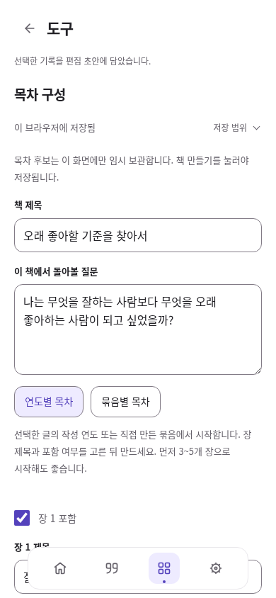

# 흩어진 글에서 첫 책까지

2026-10-08. 목표는 **자료 가져오기·검토 → 작성 시기/묶음별 탐색 → 질문과 변화 정리 → 목차 구성 → 집필·개정·복원 → 전체 검토 → PDF**다. 개별 버튼이나 PR 수를 완료 기준으로 삼지 않는다. root가 화면·흐름을 통합하고 독립 모델 구현, 보존 리뷰, 실제 UI 체험을 분리했다.

## 먼저 확인한 상태

선행 #45 회고, #46 책/장, #47 사용자 해석·근거/반례, #48 전체 읽기·편집 복귀, #49 개정본·보관함·인쇄를 재사용한다. GitHub 조회에서 #35~#49는 아직 열린 초안 PR이다. 현재 작업은 #49의 `6fd88f6d67441751c511bb3e77e66d8dc17ef0a9` 위이며 운영 배포와 별개다.

빈 작업공간에서 익명 자료를 직접 가져와 기존 UI로 네 장과 PDF를 만들었다. 원고·복원·인쇄 자체는 작동했다. 그러나 회고 전체가 한 장으로 복사되어 첫 장의 불필요한 원문 연결을 다섯 번 해제하고 나머지 장에서 다섯 개를 다시 골라야 했다. 발췌의 주제와 원문 묶음이 모두 ‘주제별’로 보여 오해할 수 있었고, 마지막 출처 검토도 장마다 흩어져 있었다.

해결 순서는 재선택 제거 → 분류 의미 명확화 → 출력 전 전체 점검이다. 새 편집기나 진행상태 DB를 도입하지 않는다. [공식 오픈소스 비교](../life-tools-design/open-source-review.md#첫-책-만들기--시간주제에서-목차와-원고로-연결)의 mdBook·novelWriter에서 목차/원고/참고자료 구분만 참고하고 기존 native 입력·Reflection·Books·BookHistory·BookPrint를 사용한다.

## 체험 경로

해당 브랜치에서 `npm run dev`로 실행한다. 보호 화면의 공용 로그인은 기존 환경 설정을 사용한다. 시험용 계정·자료를 실제 개인 공간에 자동 넣지 않는다.

1. 기록에서 글을 가져오고 원문·작성자·작성일·확보 범위를 확인한다. 필요하면 정확한 문장을 발췌한다.
2. 기록 선택 → **회고에 담기**에서 버전을 검토한 뒤 담는다. 이전 버전을 선택했으면 그 버전을 유지한다. 한 번에 100개, 회고 전체는 1,000개까지다.
3. 회고에서 **연도별 / 묶음별**로 읽는다. 묶음은 원문 연결이며 발췌의 주제와 별개다. **선택한 글 묶기 → 묶음에 담기 → 회고에서 읽기**로 재선택 없이 왕복한다. 작성 시기와 경험 시기는 구분한다.
4. **선택한 글로 목차 구성**에서 책 제목·질문을 쓰고 연도별/묶음별 후보의 제목·포함 여부를 확인한다. **이 목차로 책 만들기**를 누르면 선택한 장과 정확한 원문 연결만 새 책에 저장한다. 회고와 원문은 유지되며 장 원고를 자동으로 해석·복제하지 않는다.
5. 각 장의 원고와 **생각과 근거**에 현재 해석·다른 관점·아직 모르는 점을 쓴다. 원문은 별도로 열어 대조한다. **이전 장 / 다음 장**은 저장 뒤 이동한다.
6. **개정본 → 현재 원고 보관** 후 고쳐 쓰고 필요하면 복원한다. 복원 전 원고도 자동 사본으로 남는다. 전체 2 MiB·책당 10개 한도는 유지한다.
7. **전체 원고 읽기 → 원고 점검**에서 빈 원고·없는 참조·타인 글·작성자/시기 미확인·본문 미확보를 확인한다. **이 장 확인**으로 수정하고 읽던 곳으로 돌아온다.
8. 포함할 원문 본문 옵션을 확인해 **인쇄 · PDF**를 연다. 운영체제 인쇄 창에서 PDF로 저장하고 실제 파일을 재열어 확인한다. 앱은 인쇄 요청을 파일 저장 성공으로 표시하지 않는다. 복원 가능한 사본은 별도의 **관리 → 자료·구성 JSON**으로 받는다.

## 저장과 의미의 경계

- 새 스키마·SQL·앱 의존성 없음. 기존 `life-workbench-v1`의 책/장/질문/정확 버전 필드만 저장한다.
- 목차 후보의 제목·질문·분류·포함 선택은 해당 화면 세션의 임시 초안이다. 책 만들기 전에는 새로고침 후 보관을 보장하지 않으며 화면에 이를 명시한다. 연도/묶음 후보 사이를 오갈 때 각각의 입력은 유지한다. 후보 갱신은 명시 행동이며 확인 후 현재 회고 선택·보기 기간으로 다시 만든다.
- 기간 밖 자료는 회고에서 제거하지 않는다. 미확인 날짜/없는 정확 버전도 후보에서 표시한다. 묶음이 겹치면 같은 버전을 여러 장에서 쓰며 이는 원문 복제가 아니다. 책 기간은 자동 추정하지 않는다.
- 책 생성 후보는 전체 검증을 거친 뒤 CAS로 저장한다. 실패한 초안을 다시 저장해도 같은 책 ID를 사용한다. 생성 실패를 이유로 원문이나 회고를 변경하지 않는다.
- 회고 담기는 성공한 저장 뒤에만 원래 선택을 소비한다. 첫 저장 실패 후 재시도도 같은 계약을 따른다.
- 다른 탭의 저장 알림이 먼저 나타났어도, 버튼을 누를 때 새 미저장 초안/저장 중/조합 입력을 다시 확인한다. 오래된 다시 읽기 조작으로 새 초안을 덮지 않는다.
- 점검은 `Books.project`의 현재 출력 범위에서 계산한 사실이다. 보관한 장/제외한 해석은 출력에서 빠지지만 백업에는 남는다. 타인 글을 사용자의 생각으로 표시하거나 성장/성격 점수를 만들지 않는다.
- 원문·exact 버전·UTF-16 발췌 위치·계정별 저장·원문/구성 이어쓰기·백업·이미 게시한 공개 사본은 기존 계약을 유지한다. 외부 AI 전송, SNS 원본 수정, 새 자동 공개 없음.

## 검증 증거

기능·사용 흐름·시각·출력물을 각각 확인했다. 시험은 Chromium 151, 격리된 익명 Auth HTTP와 실제 동봉 SDK/IndexedDB에서 수행했다. 책·원고를 미리 저장소에 주입하지 않고, 빈 작업공간에서 가져오기 화면으로 6개 출처/7개 버전과 옛 버전의 발췌를 만들었다. 2016·2019·2021·2025년, 내 글/타인 글/작성자 미상, 부분 본문/링크만 보관/시기 미상을 포함한다.

| 구분 | 이번 결과와 증거 |
| --- | --- |
| 기능 보존 | `npm run check`: 18 HTML·58 JS·271 참조/PWA. `npm test`: 386/386. 기존 회고 5·책 프로젝트 7·해석 7·전체 읽기 6·개정/복구 7·인쇄 3·자료 정리 14개 흐름 재실행 통과. [회귀 요약](evidence/book-workshop/regression-summary.json) |
| 실제 사용 흐름 | 1440·820·390px에서 UI 가져오기 → 회고/묶음 왕복 → 목차 후보 5개 중 4개 선택 → 빈 장 집필 → 해석/근거/반례/불확실성/제외 → 전체 검토·장 수정 → A 개정본/B 수정/복원 전 B 보관 → JSON 새 공간 복원 → Markdown/PDF. 별도 후보 유지·중복 생성 방지 포함 4/4. [원본 실행을 구분한 통합 기록](evidence/book-workshop/flow-report.json) |
| 독립 실패/경합 | 새 회고 버튼 활성화, 첫 저장 실패 후 재시도·선택 소비, 오래된 다시 읽기 버튼의 새 초안 덮기 차단·명시 CAS 비교, 지연된 책 저장 중 계정 전환. 3/3. [독립 보고서](evidence/book-workshop/recovery-report.json) |
| 시각·접근 | 세 화면 폭에서 목차/빈 장/전체 점검/복원/오류 총 11개 상태를 검사. 가로 넘침·이름 없는 조작·44px 미달·16px 미만 입력·대비 실패 0, 최저 작은 글자 대비 6.05:1. 키보드 생성/장 이동·터치 크기를 검토. 마지막 목차 전용 화면과 회고 복귀는 별도 3/3. [최종 배치 기록](evidence/book-workshop/layout-report.json) |
| 출력물 | 실제 앱이 만든 인쇄 HTML을 Chromium으로 PDF 생성. **A4 5쪽**의 선택 가능한 한글, 네 장의 원고·활성 해석·불확실성·출처를 대조. 제외한 해석/최신 대체 버전/기본 옵션에서의 원문 본문 미포함 확인. [익명 첫 책 PDF](evidence/book-workshop/first-book.pdf) · [동일 원고 Markdown](evidence/book-workshop/first-book.md) |

콘솔·페이지 오류와 예상 밖 외부 요청·운영 쓰기는 0이다. 최초 회귀가 모두 통과한 것으로 덮어쓰지 않았다. 실제 피드의 회고 버튼 활성화 누락은 수정했고, 오래된 테스트의 ‘101개 전부 DOM에 존재’ 가정은 기존 40개씩 더보기 UI를 사용하는 것으로 고쳤다. 새 체험 테스트의 비동기 장 이동 대기·미리보기 재진입 ID 처리도 실제 계약에 맞췄다. 초기 실패와 수정 후 증거는 통합 보고서에서 구분한다.

시각 검토에서 처음에는 목차 후보 앞에 기존 회고 조작이 쌓여 있었다. 목차 구성 중에는 후보만 보여주고 회고로 돌아오면 선택·글·보기 조건을 유지하도록 줄였다. 임시 후보를 저장하는 것으로 오인할 수 있는 공통 ‘지금 저장’ 버튼도 이 화면에서는 숨겼다. 전체 점검은 평소 접혀 있으며 글의 점수나 강제 완료 체크리스트를 만들지 않았다.

[1440px 목차](evidence/book-workshop/outline-1440.png) · [820px 목차](evidence/book-workshop/outline-820.png) · [전체 원고 점검](evidence/book-workshop/review-390.png) · [PDF 첫 쪽](evidence/book-workshop/pdf-page-one.png) · [수정 전 단일 장 복사](evidence/book-workshop/before-single-chapter.png)

실제 개인 원고와 Apple 기기·한글 IME·Files·OS 인쇄 창에서 저장 버튼을 누르는 동작은 미검증이다. 브라우저 인쇄 문서와 생성된 PDF 검증을 Mac/iPad/iPhone의 실제 파일 저장 성공으로 보고하지 않는다. 현재 PDF는 원고와 근거를 함께 검토하는 A4 출력이다. 양면 책자 배열·정밀 조판·출판용 서체 포함·접근성 태그 PDF를 구현했다고 주장하지 않는다. 자동 심리 분석/AI 보고서도 이번 기능이 아니다.

## Local 인계와 다음 순서

1. #35부터 이어진 선행 PR의 현재 병합 상태와 SQL 설치 이력을 다시 확인한다. 선행 PR 순서대로 검토·병합하고 이번 브랜치는 #49 위에서 마지막으로 적용한다. 이미 설치한 SQL은 반복하지 않는다. Cloud는 병합·배포·운영 SQL을 실행하지 않았다.
2. 구성/초안 이어쓰기 운영 전제는 [일괄 인계](../life-tools-design/continuity-batch-installation.md), 책/해석/개정본 validator는 [#49 인계](book-recovery-print.md#local-인계)를 따른다. 최신 editions validator를 설치한 뒤 과거 validator를 재실행하면 기능이 내려간다. 이번 변경 자체에는 SQL이 없다.
3. `npm run check`, `npm test`, `node tests/book-workshop-browser.cjs`, `node tests/book-workshop-recovery-browser.cjs`와 CI를 확인한다. 브라우저 검사는 별도 익명 계정 HTTP와 실제 동봉 SDK/IndexedDB를 사용한다. 실제 운영 계정/합성 DB 자료를 만들지 않는다.
4. Local 배포 뒤 공용 로그인 → 본인 자료 소량 → 회고 → 네 장 → 개정본/복원 → JSON/PDF 재열기를 Mac·iPad Chrome·iPhone에서 체험한다. 서비스워커 `haedo-v83`과 새 버튼, 원문·정확 버전·공개 사본 보존을 확인한다.
5. 우선순위는 **실제 한 권의 초고 완주에서 불편 수집 → 긴 원고의 반복 개정 부담 개선 → 필요한 경우 정밀 책자 조판**이다. 자동 분석·SNS 자동 수집은 실제 자료와 전송/비용/동의 계약이 정해진 뒤 별도로 판단한다.
