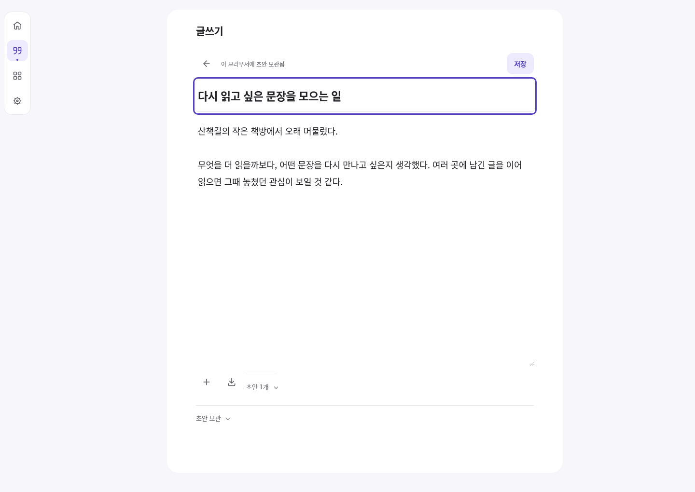
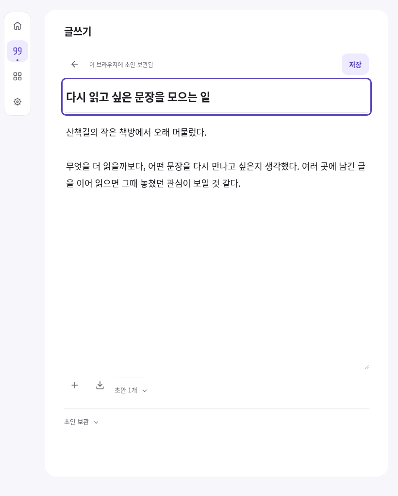
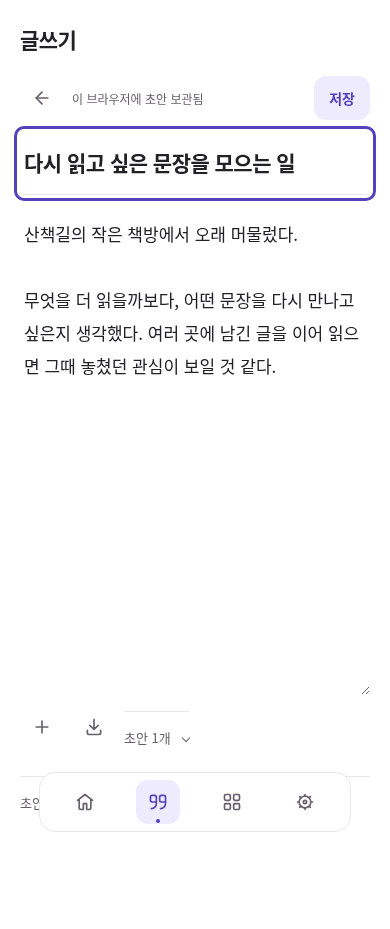

# 직접 글쓰기 — 기록으로 저장하고 이어 쓰기

2026-10-05. 선택 편집·공개 사본 다음 단계인 개인용 직접 글쓰기를 기존 앱에 연결한다. 흰 본문과 옅은 선택 색, 승인한 공통 아이콘·하단 메뉴를 유지한다. 제목·본문을 쓴 뒤 기록으로 저장하고, 나중에 새 버전으로 수정할 수 있다. 공개 게시와는 별개다.

## 사용 흐름과 범위

홈이나 기록의 연필 아이콘 → 제목·본문 → 자동 초안 보관 → 명시적 저장 → 개인 기록에서 읽기·찾기 → 최신 글 수정. 저장한 글은 기존 발췌·묶음·내 페이지 선택과 자료 JSON/Markdown 내보내기를 사용한다. 최신 글을 수정해도 이전 본문과 그 버전에 고정한 발췌·페이지 항목·공개 사본을 바꾸지 않는다.

입력 중 초안은 같은 계정·작업공간의 **이 브라우저**에만 보관한다. 다른 영역·로그아웃으로 이동하기 전에 보관하고, 실패하면 화면 입력을 유지한다. 초안 파일 내보내기는 TXT 사본이다. 작업공간 JSON 백업과 개인 동기화에는 **저장한 글**이 포함되며, 아직 저장하지 않은 초안은 포함하지 않는다. 동기화는 기존에 연결한 작업공간의 설정을 따르고 글쓰기만으로 연결·업로드·공개를 시작하지 않는다.

외부에서 가져온 자작 글의 `self` 표시는 해도 글 편집 권한이 아니다. 일반 가져오기로 보관한 외부 원문은 그대로 유지한다. 해도에서 만든 글만 전용 수정 경로를 사용한다. 리치 서식·이미지·작성 중 인용 삽입기는 이번 단위에 없으며, 저장한 뒤 기존의 발췌/메모·묶음으로 활용한다. 원본 SNS 쓰기나 새 SQL 설치는 없다.

## 저장과 실패 복구

- 전용 `Writing` 모듈은 기존 원천·불변 버전·원자 저장·작업 영수증을 재사용한다. 원천 종류는 기존 `other`, 내부 원천 경로는 `haedo:writing:<UUID>`다. 이는 앱 생성 경로 식별자이며 실제 작성자 신원을 증명하지 않는다. 원격·백업 스키마에 임의 필드를 더하지 않는다.
- 초안은 기존 staging 저장소에서 `kind=writing`과 `life-writing-draft-v1` 계약으로 구분하고 검증한다. 가져오기 초안과 목록·처리 경로가 섞이지 않는다. 운영 DB에는 보내지 않는다.
- 명시적 저장은 자료 변경과 해당 초안 소비를 한 트랜잭션으로 실행한다. 이미 저장한 본문 버전은 덮어쓰지 않으며, 다른 탭의 초안 변경이나 같은 글의 더 최신 편집을 확인 없이 덮어쓰지 않는다. 충돌 시 입력 사본을 따로 보관할 수 있다.
- 본문은 native textarea에서 받은 텍스트 그대로 저장한다. 공백 제거·HTML 변환을 하지 않는다. 새 글의 줄바꿈은 textarea의 LF를 기준으로 하며 기존 가져온 원문의 CRLF/UTF-16 위치는 바꾸지 않는다. 조합 입력 중 편집 DOM을 교체하거나 저장을 확정하지 않는다.
- 기존 데이터 구조에서 제목은 원천의 현재 제목이다. 과거 **본문**은 보존하지만 버전별 제목 이력을 따로 제공하지 않는다. 과거 원문 보기에는 현재 제목이 보이며, 이미 만든 페이지/공개 사본은 기존 고정 제목을 유지한다.

## 디자인과 선택 근거

본문을 처음부터 볼 수 있는 평문 편집 화면을 사용한다. 글쓰기 제목 행, 작은 조작 행, 제목 입력, 긴 본문, 보관 상태 순서다. 초안 목록과 보관 범위 설명은 펼쳐서 볼 수 있다. 입력은 16px 이상, 조작은 44px 이상이며 키보드 초점·안전 영역·동작 줄이기 설정을 기존 스타일에서 이어받는다.

[최신 공식 편집기 비교](../life-tools-design/open-source-review.md#직접-글쓰기--기본-textarea와-편집기-비교)를 기준으로 native textarea를 재사용했다. CodeMirror/Tiptap/ProseMirror는 여러 줄 평문과 초안에 필요한 범위를 넘어서는 문서 모델·직렬화·업데이트 부담이 있어 이번에 도입하지 않았다. 서식·구조 편집이 실제로 필요해지면 다시 비교한다. 프레임워크·CDN·추가 패키지는 없다.

반대 검토: 글쓰기 자체가 자료 통합보다 우선인지는 이후 실제 사용으로 확인한다. 이미 쓰는 메모 앱이 더 편하면 기존 가져오기 경로를 계속 사용할 수 있다. 이번 단위는 새 에디터 기반을 고정하지 않고 기존 저장 계약으로 끝까지 써볼 수 있도록 한다.

## 브라우저 화면

모두 익명 합성 자료다. 아래 제품 예시는 세 폭에서 같은 짧은 한글 글을 사용하며 제목 입력의 키보드 초점이 보인다. 오류/긴 글 검사는 별도 더 긴 샘플과 HTML 모양 문자열로 실행해 평문 보존도 확인했다.

| 1440px | 820px | 390px |
| --- | --- | --- |
|  |  |  |

[긴 글·오류·빈 상태 검토](evidence/direct-writing/visual-review.md) · [전체 흐름 v6](../diagrams/rendered/activity_hub_v6.svg)

## 검증

- 정적 검사: HTML 17 / JS 43 / 로컬 참조 228 / PWA 통과. [로그](evidence/direct-writing/static-check.log)
- Node 회귀: **250/250**. 쓰기 모델 16건과 저장 47건을 포함한다. [로그](evidence/direct-writing/node-tests.log)
- 직접 쓰기: **12/12**(기능 9 + 세 폭 검토 3), 시각 상태 9개. 서로 다른 집중 실행의 각 사례 최신 결과를 합산했으며 단일 전체 재실행으로 보고하지 않는다. 초기 fixture 가정 실패와 재검사 원본을 보존했다. [집계](evidence/direct-writing/verification-summary.json)
- 기존 홈·인증/초안 흐름 **13/13**, 공개 사본 **17/17 + 21상태**, 플랫폼·서비스워커 v65→v66 업데이트 **9/9** 통과. [홈](evidence/direct-writing/home-regression-final.log) · [공개](evidence/direct-writing/share-regression.log) · [PWA](evidence/direct-writing/pwa-regression.log)
- 저장한 글의 두 브라우저 동기화 **1/1**: 같은 계정의 A→B 수신·B 수정→A 반영, 이전 버전 보존, 초안 제외를 확인했다. 실제 SDK/IndexedDB와 모의 HTTP를 사용했고 합성 쓰기는 정확히 2회다. 운영 Supabase/Apple 실기 검증은 아니다. [결과](evidence/direct-writing/sync-browser-report.json)
- 새 글쓰기 시각 검토의 가로 넘침·44px 미달 조작·16px 미달 입력·이름 없는 조작·대비 실패 0, 최소 작은 글자 대비 **6.05:1**. 콘솔·페이지 오류 및 허용하지 않은 외부 요청 0. 한글 IME는 합성 이벤트, 820/390은 Chromium touch 설정이다.
- 초기 홈 검사에서 Google 클릭 후 복귀 시간초과 1건이 있었고, 느린 스크립트 로딩 중 로그인 버튼이 핸들러보다 먼저 활성화될 수 있는 구간을 확인했다. HTML의 초기 버튼을 비활성으로 두고 인증 설정·핸들러가 준비된 뒤 활성화한다. 스크립트를 의도적으로 지연한 회귀를 추가한 최종 홈 검사는 13/13이다. [초기 로그](evidence/direct-writing/home-regression.log)
- Mermaid 12.1.0으로 v6의 한글·접근 가능한 제목/설명, 노드 14·간선 18을 렌더링했다. [기록](evidence/direct-writing/diagram-render.log)

검증 결과와 공개 적용 상태는 이 변경의 PR에 기록한다. 브라우저 크기 검사는 실제 Apple 기기·한글 IME·Files 검증과 구분한다. 모의 Auth/서버를 사용하는 기능 검사를 운영 계정 게시나 실제 기기 간 동기화 검사로 보고하지 않는다.
