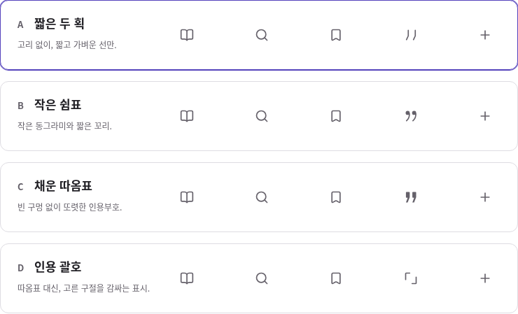

# 따옴표 4안 비교

2026-10-04 KST. 사용자가 다른 아이콘에는 긍정적으로 반응했고 현재의 속이 빈 따옴표 모양만 다시 비교해 달라고 요청했다. 다른 아이콘·색·메뉴 위치·20px 크기를 유지하고 따옴표 후보만 바꿨다. 기본 시안의 따옴표를 임의로 확정·교체하지 않았다.

| 안 | 형태 | 비교할 점 |
| --- | --- | --- |
| A · 짧은 두 획 | 고리와 채움 없는 짧은 선 | 주변 선형 아이콘에 가장 가볍게 맞지만 작은 크기에서 인용 뜻이 약해질 수 있음 |
| B · 작은 쉼표 | 작은 둥근 점과 짧은 꼬리 | 둥근 인상과 익숙한 인용 뜻을 함께 비교. 첫 추천 후보 |
| C · 채운 따옴표 | 속을 채운 짧은 인용부호 | 작은 크기에서도 또렷하나 선형 아이콘보다 무게가 있음 |
| D · 인용 괄호 | 선택한 구절을 감싸는 두 모서리 | 따옴표 대신 발췌 범위를 나타내는 대안. 사용자에게 뜻이 명확한지 확인 필요 |

후속 요청에 따라 네 후보의 도형을 키워 주변 아이콘과 눈에 보이는 높이·너비를 맞췄다. 확대 그림을 제거하고 실제 메뉴의 20px SVG만 보여준다. 주변 아이콘과 같은 회색·중앙 정렬·44px 영역을 사용하며 선형 후보의 선 두께도 기존 2로 맞췄다. A의 테두리는 비교 페이지의 초기 선택일 뿐 추천 확정·앱 적용을 뜻하지 않는다. 선택을 바꾸면 아래 메뉴·원문 도구가 함께 갱신된다.

`npm run dev` 후 `quote-sample.html`에서 눌러 비교한다. [큰 화면](evidence/quotes/board-1080.png), [820px](evidence/quotes/board-820.png), [390px](evidence/quotes/board-390.png). 네 따옴표 후보는 직접 작성한 단순 SVG이며, 주변 아이콘은 기존 [Lucide 로컬 원본과 고지](../../vendor/lucide/README.md)를 재사용한다. 새 라이브러리·외부 요청·계정·저장 연결은 없다.

Linux Chromium에서 크기 보정 후 1080·820·390px의 3장면, 각 폭의 4안 선택 총 12회와 키보드 Tab/Space 선택을 확인했다. 후보 선택 상태가 한 개만 표시되고 메뉴·원문 도구의 미리보기 둘 다 바뀌는지, 카드의 접근 가능한 이름·44px 이상 조작 영역·20px 실제 아이콘·가로 넘침을 확인했다. 콘솔/페이지 오류·외부 요청은 0건. 비교표와 390px 이미지를 직접 검토했으며 실기 체험이나 사용자 선호 검증은 아니다. 정적 HTML 16/JS 32/참조 171/PWA 통과. 확인 스크립트·보고서는 `.local/design-review/quotes/`에 있다.
