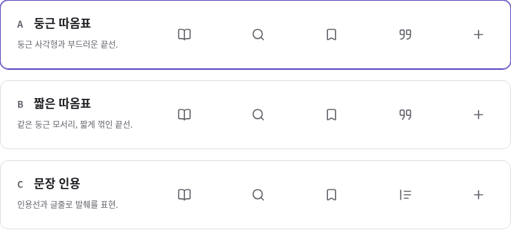

# 인용 아이콘 — 윤곽선 3안

**선택 완료: A · 둥근 따옴표.** 사용자의 “A로 가자”에 따라 `social-sample.html`의 내 발췌 메뉴, 자료 목록 발췌 버튼, 원문 도구에 같은 A 도형을 반영했다. 공통 기준은 [DESIGN.md](../../DESIGN.md)에 기록했다. 운영 앱의 공개 배포를 뜻하지 않는다.

2026-10-04 KST. 크기를 맞춘 이전 후보도 주변 아이콘과 스타일이 다르다는 사용자 피드백을 반영했다. 이전 후보의 채움·점·가는 쉼표는 책·검색·북마크의 일정한 윤곽선과 무게가 달랐다. SVG의 영역만 맞추는 것으로는 해결되지 않았다.

세 안 모두 채움 없이 24×24 좌표계, 2단위 선, 둥근 선 끝·이음, 회색, 실제 20px 크기와 44px 영역을 사용한다. A/B의 사각 부분은 책·북마크와 같은 2단위 모서리 반경이다. 주변 아이콘은 그대로 두고 따옴표의 내부 여백과 끝선 형태까지 다시 그렸다.

| 안 | 형태 | 판단 |
| --- | --- | --- |
| **A · 둥근 따옴표 — 사용자 선택** | 둥근 사각 윤곽과 한 줄로 이어지는 곡선 | 따옴표의 뜻을 유지하면서 주변의 둥근 선형 아이콘과 가장 자연스럽게 이어짐 |
| B · 짧은 따옴표 | 같은 사각 윤곽과 짧게 꺾인 끝선 | 곡선보다 단정한 형태를 원할 때 비교할 대안 |
| C · 문장 인용 | 왼쪽 인용선과 세 개의 글줄 | 따옴표 자체를 쓰지 않고 발췌한 문장을 나타내는 대안. 실제 사용자에게 의미가 명확한지는 별도 확인 필요 |

`npm run dev` 후 `quote-sample.html`에서 각 안을 누르면 메뉴·원문 도구의 미리보기가 함께 바뀐다. 채택한 A는 기본 디자인 시안에 고정하며 비교 화면에서 B/C를 눌러도 바뀌지 않는다. [1440px](evidence/quotes/board-1440.png), [820px](evidence/quotes/board-820.png), [390px](evidence/quotes/board-390.png)에서 볼 수 있다. [이전 4안](https://github.com/wonchance-art/life-haedo/blob/e30e296b901ffe28b500d93a38ef87d876c81dff/docs/design-review/quote-options.md)은 비교 이력이다.

새 후보는 직접 작성한 단순 SVG다. 기존 Lucide 따옴표의 복잡한 외곽과 앞선 채움형을 그대로 확대하지 않고, 주변 도형의 선·모서리를 따라 다시 구성했다. 주변 아이콘은 [Lucide 1.51.0 로컬 원본과 고지](../../vendor/lucide/README.md)를 재사용한다. 새 라이브러리나 외부 요청은 없다.

## 이번 확인

- **동작:** Linux Chromium의 1440·820·390px에서 3안 선택 총 9회와 각 폭의 Tab/Space 선택. 하나의 선택 상태, 메뉴·원문 도구 갱신, 접근 가능한 이름, 44px 이상 조작 영역, 20px 아이콘, 가로 넘침을 확인했다. 콘솔·페이지 오류와 외부 요청 0건. 정적 HTML 16/JS 32/참조 171/PWA 통과.
- **시각:** 실제 크기의 비교표와 390px 전체 이미지를 직접 검토했다. 같은 윤곽선·색·중심과 한글 줄바꿈을 확인했으며 A를 추천한다. 이는 시각적 판단이지 사용자 선호 검증은 아니다.
- **채택 후:** A를 기본 디자인 시안에 반영하고 1440·820·390px 목록/원문 6장면의 아이콘 정렬과 발췌·담기·출처·필터·내 발췌 탐색을 확인했다. [적용 화면과 검사](icon-refinement.md)를 참고한다. 비교 페이지도 3장면·9회 선택을 다시 확인했다.
- **범위:** 기본 디자인 시안과 비교 기록을 수정했다. 실제 Mac/iPad/iPhone 체험이나 공개 배포를 하지 않았으며 운영 앱의 인증·저장·동기화·백업·발췌 코드는 변경하지 않았다. 확인 스크립트와 이번 보고서는 `.local/design-review/quotes/`에 있다.
