# 해도 구조와 흐름 · v3 보관본

후속 사용자 결정은 [통합 흐름 v4](README.md)를 따른다. SNS는 가져오기 전용으로 확정되어 이 보관본의 외부 SNS 게시·수정·삭제 실행은 최신 제품 범위에서 제외됐다. 해도 공유 사본의 게시·갱신·철회와 선택한 외부 AI 분석은 각각 별도 개념이다. 아래는 v3 작성 당시의 설명·검증 기록이다.

2026-10-05. `life_haedo_final_backup.zip`의 대화·인계·그림·기존 Mermaid와 이후 사용자 결정을 대조해 갱신했다. [전체 맥락 대조](../life-tools-design/context-review.md#2026-10-05-전체-백업-재검토와-v3)와 [라이프스타일 블로그 설계](../life-tools-design/lifestyle-blog.md)를 함께 본다. 백업 원문과 이미지·ZIP은 공개 저장소에 복제하지 않았다.

## 도식 보기

| 도식 | 읽을 내용 | 편집 가능한 원본 | 바로 보기 |
| --- | --- | --- | --- |
| 생활·제품 흐름 | 생활과 여유 → 기록·내 글 → 탐구·관계·표현 → 다시 생활 | [Mermaid](life_experience_v3.mmd) | [SVG](rendered/life_experience_v3.svg) |
| 시스템 구조 | 현재 인증·원문·검색·동기화와 후속 글쓰기·추천·보고서·공유본 | [Mermaid](platform_workflow_v3.mmd) | [SVG](rendered/platform_workflow_v3.svg) |
| 게시·전송 실행 | 고정된 승인 범위, 내부 확정/외부 전송, 결과 대조 | [Mermaid](platform_approval_recovery_v3.mmd) | [SVG](rendered/platform_approval_recovery_v3.svg) |
| 취소·철회·보류 재개 | 실행 상태별 취소, 공개 철회/근거 삭제, 저장 실패·재개 | [Mermaid](platform_lifecycle_recovery_v3.mmd) | [SVG](rendered/platform_lifecycle_recovery_v3.svg) |

먼저 생활·제품 흐름을 읽고 필요한 상세도를 연다. 시스템·실행 도식은 세부 연결이 많으므로 SVG 원본을 열어 확대한다. 한 장으로 축소해 모든 글자를 읽도록 만들지 않았다. `.mmd`가 편집 원본이고 SVG는 검증된 보기용 산출물이다.



## 읽는 기준

- **보라색 실선 테두리 / ‘현재’ 영역:** 실제 코드에 있는 기반이다. 런타임 대조 기준은 PR #24의 `fa9a8e6`이다. 이번 도식 검사가 앱 기능·실제 기기 전체를 다시 검증했다는 뜻은 아니다.
- **회색 점선 테두리 / ‘후속’ 영역:** 아직 구현하지 않은 설계다. 글쓰기·추천·대화·보고서·공개/친구 공유와 게시 실행·취소·철회 도식 전체가 해당한다. 상자를 그렸다고 서비스·테이블·worker·AI가 설치된 것은 아니다.
- **회색 바탕:** 앱 밖의 생활과 실제 경험이다. 아래의 ‘다시 생활’은 위의 생활로 복귀한다는 의미로, 선이 본문을 가로지르지 않도록 반복 표시했다.
- **화살표:** 자료·행동·결과의 연결이다. 모든 단계를 거쳐야 하는 일정이나 구현 순서를 뜻하지 않는다. 읽고 종료하거나 개인 보관만 해도 된다.

현재 개인 공간은 공용 인증의 서버 확인 뒤 계정 범위 안에서 열린다. `view-only`·공개 쿼리로 개인 저장소 연결을 막는 현행 보호 코드는 공개 블로그 읽기의 구현이 아니다. 후속 방문자는 허용된 공유 사본만 받으며 개인 작업공간을 조회하지 않는다.

현재 개인 동기화의 서버 영수증은 같은 요청의 응답 유실 복구에 쓰인다. **아직 없는 외부 게시 연결에 그 보장을 그대로 적용하지 않는다.** 실행도에서 외부 결과 불명은 재전송보다 상태 대조가 먼저다. 보관 초안과 확정 자료, 로그인·동기화 시작·분석 선택·공개 범위도 서로 구분한다.

## 백업에서 유지하거나 바꾼 것

| 백업 맥락 | v3 반영 |
| --- | --- |
| 직접 경험·깊은 탐구·사람과의 교류·선택적 표현, 자동화로 여유 확보 | 생활 순환도와 깊은 대화·친구/모임 가지. 모든 기록을 콘텐츠 생산으로 바꾸지 않음 |
| 준비된 도구 위에서 변화만 기록, 한 페이지에서 맥락 유지 | 기존 도구와 읽기·저장 직행 경로 유지. 범용 AI 채팅을 필수 입구로 두지 않음 |
| 처음에는 플랫폼 우선을 제안했으나 후속 대화에서 실제 필요 우선으로 수정 | 별도 운영센터·모든 분야 도구·상시 다중 에이전트를 선행 조건으로 두지 않음 |
| 방문자가 나의 서재에 들어오는 경험 | 선택한 글과 모음의 라이프스타일 블로그. 옛 책상·3D 장식 대신 최신 본문 중심 디자인 기준 유지 |
| 이후의 가져오기 우선과 최신 직접 글쓰기·추천·자기 이해 | 현재 자료 기반과 미구현 기능을 같은 구조에서 표시하되 상태는 분리 |

자기 이해는 개인 기록의 의미를 살펴보는 흐름이다. 개발 개선은 **실제 사용 피드백 → 가까운 개선 가설 → 비교·선택 → 필요한 구현·검증**이라는 별도 작업 방식이다. 보고서 생성이나 AI 제안 문서 수정이 새 개발·공개 실행을 자동 촉발하지 않는다. 성공 기준은 표현 만족·유용한 발견·이해·관리 부담 감소이며 체류 시간·저장량으로 대신하지 않는다.

## v2의 미결 O-01~O-09 처리

아래는 **설계에 반영한 위치**이며 구현 완료·보장 증명이 아니다.

| 항목 | v3에서의 위치 |
| --- | --- |
| O-01 단순 조회 | 시스템 `AUTH → READ`, 확정 자료 변경·AI 호출 불필요 |
| O-02 보류·재개 | 취소·복구 `STORE / UNSAVED / WAIT / RESUME`. 상태 저장 성공 전 보관 완료 표시 금지 |
| O-03 내부/외부 결과 | 실행 `CHECKTARGET → LOCALCHECK / EXTCHECK`. 취소·보류의 불명 상태도 여기로 복귀 |
| O-04 원본/공개 사본 | 시스템 `PRIVATE / SNAPSHOT`, 실행 `PREP`. 원본 편집만으로 재게시하지 않음 |
| O-05 취소 요청/완료/불명 | 취소·복구 `BEFORE / CANCELDONE / RUNNING / CANCELFAIL`. 실행 중에는 대상별 조회 |
| O-06 삭제·철회 전파 | 취소·복구 `CHANGE / PUBLIC / PRIVATE / CLEAN`. 공개 철회는 공개 범위만, 원문·분석 변경은 선택한 근거 범위에 적용 |
| O-07 중단·여러 기기 | 현재 `SYNC`의 충돌·중지/재개와 후속 `GATE / CHECK / RESUME`의 계정·버전·범위 확인 분리 |
| O-08 새 사용자 | 현재 가져오기·기존 도구로 시작. 후속 글쓰기·질문은 기록량·AI·공개 완료를 요구하지 않음 |
| O-09 유용성·주의·비용 | 생활 순환의 종료 경로, 실행의 횟수·비용 한도, [제품 평가 기준](../life-tools-design/lifestyle-blog.md#성공을-확인하는-방법) |

취소·복구 도식은 실행도의 후속 상세다. 보류 재개는 저장된 대상·단계를 유지한다. 진행 중/결과 불명은 `CHECKTARGET`, 외부 성공 후 기록 실패는 `RECEIPT`, 확정된 미실행은 `PREP`로 간다. `PREP`와 `GATE`를 생략해 전송하지 않는다. 취소·철회 실패는 해당 종류의 요청으로만 돌아가며 게시를 다시 시작하지 않는다. 삭제 차단 후 파생 정리만 실패하면 차단을 유지하고 정리만 재개한다.

`PRIVATE`의 ‘선택한 범위’는 원문 삭제·접근 권한 철회로 더 이상 보여줄 수 없는 근거와 그 복제 인용·파생 해석이다. 독립적으로 쓴 사용자 생각은 유지한다. 단순히 향후 분석에서 제외하는 경우에는 이후 추천·보고서의 근거에서 빼고 기존 보고서에 범위 변경을 표시한다. 이를 원문 삭제와 같은 작업으로 취급하지 않는다.

## 검증과 재현

2026-10-05 **Mermaid 12.1.0 / MIT**, Node 24.19.0, Chromium 151.0.7922.173, 시스템 Noto Sans CJK KR로 4개를 실제 렌더했다. 총 80개 노드·119개 연결, 구문·접근 가능한 제목/설명·한글 글꼴·SVG 및 노드 안의 글자 범위를 검사했다. 범위 밖 글자·외부 요청·console/pageerror·HTML foreignObject는 0개였다. 직접 그림을 보고 생활 시작/복귀 위치와 실행/복구 분리를 확인했다. 수치 검사로 모든 선의 시각적 품질이나 실행 계약을 증명하지 않는다.

렌더러는 [공식 npm 메타데이터](https://registry.npmjs.org/mermaid)의 최신 버전·게시일(2026-10-02)·MIT와 배포 integrity를 확인하고, 격리된 `.local/diagram-render`에 lifecycle scripts 없이 설치했다. 설치한 LICENSE와 [공식 저장소](https://github.com/mermaid-js/mermaid)를 대조했으며 npm audit에서 보고된 취약점은 0개였다. 이는 앱 의존성 도입이나 무취약성 보증이 아니다. 기존 앱 package.json·lockfile·서비스워커는 변경하지 않았다.

```sh
npm --prefix .local/diagram-render install --ignore-scripts --save-exact mermaid@12.1.0
MERMAID_MODULE_DIR=.local/diagram-render/node_modules/mermaid node scripts/render-diagrams.cjs
```

Node 22.12 이상과 기존 Playwright·Chromium·한글 글꼴이 필요하다. 다른 환경은 `PLAYWRIGHT_MODULE`, `CHROMIUM_PATH`를 설정한다. [재현 스크립트](../../scripts/render-diagrams.cjs)는 로컬 모듈만 읽으며 외부 요청을 차단한다. Mermaid 12에서 HTML 라벨과 기본 look가 달라질 수 있어 원본과 스크립트에 `htmlLabels: false`, `look: classic`, 줄바꿈 폭을 명시했다. SVG는 이 폴더의 `rendered/`에, PNG·해시·실행 보고서는 무시되는 `.local/diagram-render/evidence/`에 쓴다.

## 이전 버전 보존

[전체 실행 v2](platform_workflow_v2.mmd)와 [승인·복구 v2](platform_approval_recovery_v2.mmd)는 수정하지 않았으며 백업의 원본과 SHA-256이 일치한다. v1은 원래 개인 백업 안에 있다. v3 갱신으로 v1/v2를 현재 구현이나 최신 실행 지시로 바꾸지 않는다. 도식과 문서 작업이며 앱·DB·개인 자료·배포 설정은 변경하지 않았다.
