# 해도 통합 흐름 · v4

2026-10-05 후속 결정. **여러 곳의 활동을 모아 개인적으로 활용하고, 원하는 결과만 편집해 나의 블로그와 공유 모음으로 보여준다. SNS 연동은 가져오기 전용이다.** 원본 SNS에 게시·수정·삭제를 보내지 않는다.

[편집 가능한 Mermaid](activity_hub_v4.mmd) · [SVG 크게 보기](rendered/activity_hub_v4.svg) · [화면 시안과 체험](../design-review/activity-hub.md) · [제품 설계](../life-tools-design/lifestyle-blog.md)

## 읽는 순서

1. **모으기:** 현재 제공한 본문·TXT/Markdown·링크를 보관한다. 계정 연결과 주기적인 자동 수집은 서비스별 공식 지원을 확인할 후속 범위다.
2. **연결·개인 활용:** 같은 활동의 기록을 참조로 묶고, 읽기·검색·발췌·기존 도구를 이용한다. 후속 추천·대화·자기 이해도 비공개로 쓸 수 있다. 묶기나 분석 없이 바로 읽고 종료해도 된다.
3. **선택·편집:** 원천별 기본값 → 모음 → 항목 예외로 편집 수고를 줄인다. 이 상속은 공개 초안의 선택 기준이며 새 자료의 자동 공개 승인이 아니다. 제목·선택 본문·내 코멘트·출처를 공유용 사본으로 구성하고 원본의 내용·버전·발췌 위치는 유지한다.
4. **미리보기·공유:** 대표 글/모음과 선택한 최근 활동을 구성하고 방문자 화면을 확인한다. 후속 실제 게시 시에는 서버 권한을 검증한 사본만 제공한다.

사용자가 체감하는 중심은 내 페이지다. 뒤에서는 같은 개인 기록을 관리·탐구·회고에 활용한다. 보고서·AI가 공개 소개나 글을 자동 수정하지 않는다. 기본은 비공개 수집 후 선택 공개이며, 사용자가 별도로 고른 자동 공개 규칙은 이후 검토할 수 있다.

## 헷갈리지 않을 구분

| 행동 | 바뀌는 범위 |
| --- | --- |
| 가져오기 중지 | 앞으로의 수집만 중지. 보관한 원문이나 공개 사본의 삭제 아님 |
| 활동 묶기/풀기 | 기록 사이의 연결·배치. 원문 병합·삭제나 전체 자동 공개 아님 |
| 분석 제외 | 이후 근거에서 제외하고 기존 보고서에 범위 변경 표시 |
| 공개 초안에서 제외 | 다음 게시/갱신에 담을 내용을 수정. 이미 공개된 사본의 철회는 별도 |
| 페이지에서 숨김 | 페이지 배치에서만 제외. 직접 주소 접근을 막는 공개 철회와 다름 |
| 해도에서 공개 철회 | 서버에서 해당 공유 사본 열람 차단. SNS 원본과 개인 원문은 유지 |
| SNS 원본 변경 | 해도가 수행하지 않음. 원천의 삭제가 보관본을 조용히 지우지 않음 |

## 현재와 후속

도식의 실선 보관함은 현재 기반이다. 점선 영역은 설계이며 ‘현재/후속’을 함께 적은 상자는 기존 기능을 확장할 자리다. 활동 묶음·선택 편집·방문자 화면은 이번 독립 시안에서만 체험한다. 계정 자동 수집·글쓰기 저장 계약·공개 서버·추천·보고서가 운영 앱에 설치된 것은 아니다.

범위·버전·인용·분석 권한 검증과 계정 격리, 원문·백업·연표 값 보존은 계속 적용한다. 통합의 목적은 생활의 여유·깊은 탐구·관계·선택적 표현이며 모든 활동을 공개하거나 새 글로 생산할 의무를 만들지 않는다.

## 버전과 검증

v1은 개인 백업, v2 원본과 v3 도식·SVG는 저장소에 그대로 보존한다. [v3 비교·검증 기록](README-v3.md)은 당시 설계다. 특히 외부 SNS 발신 경로는 이번 범위에 포함하지 않는다.

Mermaid 12.1.0 / MIT의 기존 격리 설치와 [재현 스크립트](../../scripts/render-diagrams.cjs)를 재사용했다. v4 실제 렌더는 639×1526, 12개 노드·15개 연결이며 한글·접근 가능한 제목/설명·라벨 범위를 확인했다. 잘림·외부 요청·console/pageerror는 0개다. v4만 다시 렌더하려면 `node scripts/render-diagrams.cjs activity_hub_v4.mmd`를 실행한다. 브라우저 시안 검사는 [시각 자료 기록](../design-review/activity-hub.md)에 남긴다.
