# 해도 통합 흐름 · v5

2026-10-05 후속 공개 계약. **개인 기록을 모아 쓰는 흐름에서, 사용자가 확인한 사본만 별도 공개 페이지로 보낸다.** SNS는 가져오기 전용이며 원본 SNS 게시·수정·삭제를 수행하지 않는다.

개인 홈·통합 기록·묶음·내 페이지 편집과 비공개 미리보기는 기존 기반이다. **이번 공개 게시 기능은 운영 SQL 설치·실제 HTTP 권한 검증 대기 상태**로 표시한다. 이 도식은 운영 게시나 공개 배포가 완료됐다는 보고가 아니다.

[편집 가능한 Mermaid](activity_hub_v5.mmd) · [SVG 크게 보기](rendered/activity_hub_v5.svg) · [제품 설계](../life-tools-design/lifestyle-blog.md) · [공식 오픈소스 비교](../life-tools-design/open-source-review.md#선택한-사본의-공개-게시--기존-supabase와-별도-cms-비교)

## 읽는 순서

1. **모으고 활용하기:** 제공한 본문·TXT/Markdown·링크를 개인 계정의 기록으로 보관한다. 저장한 문장과 메모도 같은 기록 안에서 찾는다. 관련 기록은 묶을 수 있고, 묶거나 공개하지 않은 채 읽기·도구 사용으로 끝내도 된다.
2. **내 페이지 구성하기:** 표시할 항목·소개·본문·페이지용 코멘트를 편집하고 비공개 미리보기로 확인한다. 현재 구성은 이 브라우저에 저장하고 자료·구성 백업으로 이동한다. 표시 설정 변경만으로 서버의 공개 사본이 바뀌지 않는다.
3. **공개할 사본 확인하기:** 표시할 항목 중 본문 전체 또는 정확한 구절을 명시적으로 고른다. 본문을 넣지 않아도 제목·출처 URL·작성자 표시가 포함될 수 있으므로 실제 전송할 화면을 함께 확인한다. 개인 기록의 메모·회고, 계정/작업공간/원문 내부 ID, 미선택 항목은 전송 사본에서 제외한다. 선택한 원문 버전을 찾을 수 없으면 게시를 멈춘다.
4. **게시·갱신하기:** 서버에서 확인한 소유자가 고정된 사본을 전용 RPC로 보낸다. revision과 operation ID로 동시 변경·불확정 응답·같은 요청의 재시도를 구분한다. 현재 서버 상태를 재확인하고 기존 공개 페이지를 갱신할 때는 같은 주소를 유지한다.
5. **읽거나 철회하기:** 방문자는 로그인 없이 공개 식별자에 해당하는 사본만 읽는다. 소유자가 철회하면 서버 사본을 비우고 그 주소의 이후 조회를 차단한다. 재게시에는 새 주소를 사용하며 이전 주소를 되살리지 않는다.

## 공개의 의미와 경계

**공개 링크는 누구나 열 수 있다.** 특정인에게만 허용되는 기능이나 비밀 링크를 보장하는 기능이 아니다. `noindex, nofollow`는 검색 노출을 요청하지 않는 표시이며 접근 제어나 검색 엔진의 준수 보장이 아니다.

개인 원문 테이블을 공개하지 않는다. 익명 방문자에게 개인 계정 저장소·소유자 상태·공개 페이지 목록을 제공하지 않으며, 방문 화면은 Auth SDK와 개인 IndexedDB를 열지 않는다. 화면을 직접 HTML로 출력하지 않고 검증한 평문만 표시한다. 출처 링크는 그대로 확인할 수 있고 외부 이동에 referrer를 보내지 않는다.

공개본 관리는 원래 기기의 로컬 구성에 의존하지 않는다. 새 기기나 로컬 자료 삭제 후에도 같은 계정으로 로그인하면 **소유자 전용 공개본 목록 → 공개 철회**를 사용할 수 있게 한다. 이 목록은 제목·작업공간/공개 식별자·revision 등 관리용 메타데이터만 반환한다. 공개 본문이나 개인 페이지 초안을 기기로 동기화하는 기능은 아니며, 익명 방문자에게는 목록 조회를 허용하지 않는다.

공개 사본을 오프라인 보관하지 않는다. 서비스워커 v64는 방문자 `share.html`을 앱 셸 캐시에서 제외하고 코드 모듈만 캐시한다. 공개 본문의 POST 조회는 `no-store`를 사용한다. 보이는 화면은 30초마다 서버 상태를 다시 확인하며 같은 revision이면 읽고 있는 DOM을 유지한다. 숨김·페이지 이탈·오프라인·조회 실패 시에는 내용을 비우고 돌아올 때 재조회한다. 이는 이미 방문자가 읽거나 외부에 저장한 내용을 회수하는 기능이 아니다.

| 행동 | 바뀌는 범위 |
| --- | --- |
| 가져오기 중지 | 앞으로의 수집만 중지. 개인 보관본과 공개 사본은 별개 |
| 기록 묶기/풀기 | 관련 기록의 참조만 변경. 원문 병합·삭제 없음 |
| 내 페이지에서 숨김·편집 | 로컬 구성과 다음 게시 후보 변경. 이미 공개된 사본은 명시적 갱신/철회 전까지 별개 |
| 공개본 갱신 | 검토한 새 사본으로 교체. 현재 공개 주소 유지 |
| 공개 철회 | 서버 snapshot 제거. 이전 주소의 이후 조회 차단 |
| 철회 뒤 재게시 | 다시 확인한 사본을 새 주소로 공개. 이전 주소 계속 차단 |
| SNS 원본 변경 | 해도에서는 수행하지 않음 |

## 현재와 후속

보라색 실선은 이미 연결된 개인 사용 기반이다. 보라색 점선은 이번 공개 기능의 구현·검증 범위이며 **운영 SQL 설치와 관리형 HTTP 검증이 남아 있다**. 회색 점선은 직접 글쓰기·외부 추천·AI 자기 이해·자동 계정 수집 등 별도 후속이다. 기존 선택 자료 집계와 직접 적는 회고를 AI 분석 완료로 표시하지 않는다.

이번 검증에는 공개 사본의 허용 필드, 숨긴/미선택 내용 제외, 고정 원문 버전, 본문/구절 선택, 소유자 격리, 익명 직접 요청, 갱신/철회 경합, 낡은 성공 영수증 재시도, 캐시와 계정 없는 방문이 포함되어야 한다. 로컬 SQL 엔진·모의 HTTP 브라우저 검사와 실제 관리형 Supabase 설치·HTTP 권한 검증, 배포 완료는 각각 구분한다. 연표 값·계산과 기존 백업·동기화 형식을 보존한다.

## 버전과 도식 검증

v1은 개인 백업에 있으며 v2·v3·v4 Mermaid와 SVG는 그대로 보존한다. [v3 비교·검증 기록](README-v3.md), [v4 원본](activity_hub_v4.mmd)·[v4 SVG](rendered/activity_hub_v4.svg)는 당시 구상이다. v4에서 후속으로 표시했던 묶음·내 페이지 편집·비공개 미리보기는 이후 로컬 기능으로 연결됐다. 이번 v5는 실제 공개 사본의 권한·철회 계약을 더한다.

Mermaid **12.1.0 / MIT**의 기존 격리 설치와 [재현 스크립트](../../scripts/render-diagrams.cjs)를 재사용했다. 앱 의존성을 추가하지 않았다. `node scripts/render-diagrams.cjs activity_hub_v5.mmd`로 다시 렌더할 수 있으며 기본 실행의 v3 결과는 바꾸지 않는다. v5의 13개 노드·16개 연결, 한글, 접근 가능한 제목/설명, 네이티브 SVG를 확인했다. 라벨/전체 경계 밖 텍스트·외부 리소스/요청·console/pageerror는 모두 0개다. 이 검사는 문서 도식 렌더이며 공개 앱 기능이나 Apple 실제 기기를 검증한 결과가 아니다.
