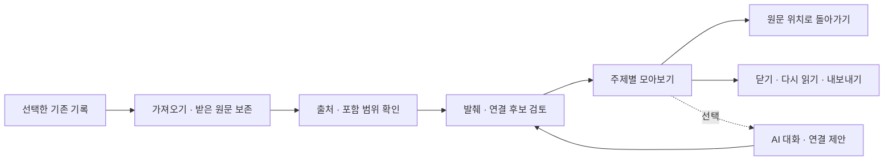

# 생활 도구 전체 설계

2026-10-03 · 설계 초안 v2. 사용자의 최신 방향에 따라 **이미 기록된 내용을 추출하고 연결·통합하는 개인 생활 도구**로 중심을 바꿨다.
이 문서는 설계다. 이후 사용자가 구현 착수를 요청했으며 R1의 실제 변경과 검증 범위는 [구현 기록](r1-implementation.md)과 [구현 계약](implementation-contract.md)에 구분한다. 전체 설계 기능의 구현·배포 완료를 뜻하지 않는다.

사용자의 주된 기록 원천은 **Apple 메모, Obsidian, 네이버 블로그, 인스타그램**이다.
각각에 남아 있는 생각·글·경험·관심을 다시 입력하지 않고 가져와, 필요한 구절과 출처를 보존하며 주제와 질문으로 모아본다.
직접 입력은 빠진 설명·연결 이유·정정을 보완한다. 원래 기록하는 앱을 바꾸는 것은 첫 사용의 조건이 아니다.

성공 기준은 수집량이 아니라 흩어진 기록에서 원하는 맥락을 더 쉽게 되찾고 활용하는 것이다.
사용자의 시간과 주의력을 아껴 직접 경험하고 감각을 기를 여유를 확보한다.
필요한 때는 과거 생각·근거·다른 해석을 연결해 관점을 정교하게 돕고, 대화·공유 없이 읽고 돌아갈 수도 있다.

## 문서 안내

| 문서 | 결정하는 내용 |
| --- | --- |
| [구상 대화와의 연결](context-review.md) | 첨부의 의도·후기 수정과 현재 사용자의 방향 전환 |
| [분야별 도구](domains.md) | 같은 자료를 생활·학습·문화·창작·관계에서 재사용하는 장면 |
| [화면과 사용 흐름](experience.md) | 가져오기·출처 대조·검토·모아보기, iPad에서 읽기와 재방문 |
| [데이터와 권한](data-model.md) | 원문 버전·발췌 위치·가져오기 검토·원자 적용·복원·공유본 |
| [AI와 자동화](ai-workflows.md) | 근거가 있는 추출·연결 제안, 깊은 대화와 선택 적용 |
| [기술 구조](architecture.md) | 원천별 도입 경로·parser·검토·저장·기존 앱 연결 |
| [오픈소스 검토](open-source-review.md) | 최신 공식 근거·재사용 후보·지원 제약·미확인 사항 |
| [구현 로드맵](roadmap.md) | 첫 흐름·단계별 완료 조건·팀과 모델/effort 배치 |
| [독립 검토와 검증](validation.md) | 불변조건·원천별 반례·복구·교차 검토와 실행 증거 구분 |

[기존 요구](../current.md), [참조 설계](../design.md), [인계](../handoff.md)와 첨부 구상을 참고하되 현재 사용자 지시를 우선한다.
이전 설계의 현장 입력·오늘 화면 중심 R1은 아래 가져오기 흐름으로 대체한다.
공통 계약은 데이터 설계, 분야 의미는 분야 설계, 구현 순서는 로드맵을 기준으로 함께 갱신한다.
저장 방식·화면·도입 라이브러리는 실제 사용 장면과 작은 실험으로 검증할 가설이다.

## 첫 원천과 도입 범위

| 원천 | 먼저 다룰 내용과 경로 | 별도 확인할 범위 |
| --- | --- | --- |
| Apple 메모 | 사용자가 선택해 복사한 본문, 실제로 내보낼 수 있는 파일 | iPad에서의 파일 형식·원작성일·첨부·폴더 유지 여부 |
| Obsidian | 선택한 Markdown·텍스트와 해당 파일 경로, 문서 사이 링크 | iPad 파일 선택 경로, 내부 링크·첨부의 미포함 항목, 폴더 단위 가져오기 |
| 네이버 블로그 | 선택한 글의 본문·제목·URL·제공된 작성 정보 | 공개/비공개 접근, 본인 글/타인 글, 이미지·댓글·수정 이력 포함 여부 |
| 인스타그램 | 선택한 게시물 링크와 제공한 캡션·설명, 이후 공식 내보내기 샘플 | 내 게시물과 타인의 저장 게시물 구분, 실제 파일 구조·미디어 범위 |

네 원천을 제품 대상으로 삼되 **R1의 파일 지원은 UTF-8 텍스트·Markdown과 선택 본문 붙여넣기·링크 등록부터** 제안한다.
서비스별 공식 내보내기 전체 형식, 계정 연동, 대량 수집, OCR, 자동 갱신은 샘플과 접근 조건을 확인한 뒤 순차 추가한다.
URL만 받은 항목은 링크로 보관하며 본문을 확보했다고 표시하지 않는다. 로그인·공개 여부와 관계없이 임의 수집 권한으로 해석하지 않는다.
출처 정보가 전달되지 않으면 모름으로 두고, 가져온 시각을 원문 작성일이나 실제 경험일로 대신하지 않는다.
지원 경로의 공식 조사 상태와 iPad 실기 미검증 범위는 기술 구조·오픈소스 검토에 남긴다.

## 화면과 기본 흐름

기본 탐색은 **모아보기 / 원천 기록 / 시간 보기**, 공통 행동은 **가져오기**다.
빈 화면에서는 파일 선택·선택 본문 붙여넣기·링크 등록으로 시작하고, 이후에는 관심 주제와 마지막 읽던 자료로 돌아온다.
기존 연표 사용자는 기존 진입 경로를 유지한다. 연표의 사건이나 실제 활동을 만들기 위해 모든 자료를 분류할 필요는 없다.



사용 환경은 **Mac·iPad·iPhone**이며 iPad Chrome은 이미 확인됐다. 긴 글과 발췌를 대조하는 세로·가로·분할 화면, 터치 선택, 파일 앱과의 이동, 앱 전환 후 복귀를 우선 확인한다.
Mac의 키보드와 넓은 화면, iPad 분할 화면, iPhone의 좁은 화면을 함께 확인한다. 화면 키보드·한글 입력은 보완 메모와 정정에서 점검한다. Chromium 화면 모사는 실제 Apple 기기·Safari/Chrome 실기 검증을 대신하지 않는다.
기본 가져오기·발췌·보관은 계정·AI 없이 끝낸다. 가져온 본문은 오프라인에서도 열 수 있지만 URL만 있는 원문과 미포함 첨부는 그렇지 않다.
긴 글을 처음부터 전부 검토하도록 강요하지 않고 자료만 보관하거나 선택 구절만 연결한 채 종료할 수 있다.

## 사용자가 얻게 될 모음

| 영역 | 기존 자료를 연결하는 예 | 보존할 구분 |
| --- | --- | --- |
| 생각·생활 | Apple 메모의 단상과 Obsidian의 질문을 함께 찾아봄 | 과거 생각·현재 생각·제안·실제 경험 |
| 책·학습 | 독서 메모·관련 질문·블로그 감상에서 같은 책의 맥락을 모음 | 판본·실제 읽은 범위·인용·타인의 감상; 진도는 확인한 경우에만 |
| 문화·여행 | 블로그의 방문 글과 인스타그램의 관심 장소 링크를 연결 | 방문한 곳과 가고 싶은 곳, 같은 주제와 같은 경험 |
| 창작·프로젝트 | 메모·초고·공개 글에서 결정 이유와 생각의 변화를 추적 | 원문 버전·현재 채택한 판단·보류한 대안 |
| 관계 | 제공된 공동 경험·관심 자료에서 건넬 소재를 찾음 | 실제 인용·연결 이유·AI 초안; 공유는 사용자가 선택 |

하나의 원문과 발췌를 여러 모음이 참조하며 분야별 복사본을 만들지 않는다.
같은 장소·날짜·문장이 나타난다는 이유만으로 같은 경험이나 같은 문서로 자동 합치지 않는다.
자료가 충분할 때 활동·계획·독서 진도를 선택해서 구조화한다. 직접 기록 도구는 실제 필요가 확인된 범위에 추가한다.

## 확정한 공통 규칙

| 결정 | 규칙과 이유 |
| --- | --- |
| D-01 원문과 버전 | Source는 원천 문서의 정체성, SourceVersion은 실제 받은 내용의 불변 버전이다. 원앱 원문 전체를 확보했다는 보장은 아니다. |
| D-02 출처와 위치 | 발췌·통합 항목은 sourceId·sourceVersionId·locator로 근거를 추적한다. 원저자/화자·원작성일·가져온 시각을 구분한다. |
| D-03 기록과 해석 | 원문·사용자의 보완·AI 추론을 구분한다. 과거 대화의 실행 명령은 현재 지시가 아니다. |
| D-04 중복과 변화 | 같은 파일 재시도, 같은 문서의 새 버전, 일부 내용 겹침을 구별한다. 출처가 다르거나 확신이 없으면 연결 후보로 남긴다. |
| D-05 선택 통합 | 가져온 자료를 임시 검토하고 선택 결과만 적용한다. 상충하는 생각과 원문 버전을 조용히 덮어쓰지 않는다. |
| D-06 저장 경계 | 채택한 원문 버전·파생 항목·참조·성공 영수증을 원자 반영한다. 성공 전 저장 완료를 표시하지 않는다. |
| D-07 기존 데이터 | 새 IndexedDB 영역을 추가하고 기존 연표·localStorage·charts는 읽기 연결부터 시작한다. |
| D-08 AI 적용 | 선택한 자료로 제안하고 원문 인용·기준 버전·변경 내용을 비교해 적용한다. 후속 편집을 보존하며 되돌린다. |
| D-09 공유와 내보내기 | 비공개 원본과 공유본을 분리한다. 백업에 원문·첨부가 실제 포함됐는지 표시하고 링크만으로 보존을 약속하지 않는다. |
| D-10 단계 확장 | R1은 가져오기부터 다시 찾기·복원까지 완결한다. 자동 연결·동기화·AI·공유는 각각의 필요와 검증에 따라 추가한다. |
| D-11 기존 구현 활용 | 최신 오픈소스의 적합성·라이선스·유지 비용을 비교한다. 원천 특유의 차이만 얇은 adapter로 보완한다. |

ImportSession은 아직 적용하지 않은 원문·후보·검토 선택을 보관한다. 검토를 재개하는 위치는 실제 활동의 재개 위치와 구분한다.
`자료만 보관`을 선택하면 원문 버전부터 확정하고 나중에 발췌·모음 연결을 별도 작업으로 저장할 수 있다. 한 번에 통합할 때는 원문과 선택 결과를 함께 확정한다. 검토 취소는 미적용 후보만 취소하며 이미 보관한 원문을 자동 삭제하지 않는다.
화면은 `검토 중`·`자료 보관됨`·`모음에 반영됨`을 구분한다. 임시 검토 저장은 통합 완료가 아니다.
원천 자료 가져오기와 앱 백업 복원은 별도 입구다. 복원은 새 사본으로 수행하고 공유·외부 작업을 자동 재개하지 않는다.
앱에서 원문을 삭제할 때는 파생 항목·발췌·공유본에 미치는 범위를 보여준다. 원앱의 삭제·변경을 자동 감지한다고 가정하지 않는다.

```js
Storage.commitLocal({ operationId, workspaceId, baseRevision, changes })
// 결과 status: stored | conflict | rejected
// 동기화 상태: not_configured | pending | syncing | synced | conflict | error
```

로컬 커밋 완료 문구는 `이 브라우저에 저장됨`이다. 별도 백업·다른 기기 접근·브라우저 데이터 삭제에 대한 보호를 뜻하지 않는다.
성공한 작업의 같은 재제출은 한 번만 반영한다. 실패하면 검토 선택을 보존하고, 충돌로 내용/기준이 바뀌면 새 작업으로 제출한다.
Object·Plan·Activity·Record·Thought의 기존 의미와 진도 구분은 유지하되 모든 가져오기에서 생성을 요구하지 않는다.

## 구조와 다음 결정

일반 JavaScript와 정적 배포를 유지하고, 원천 입력 → 파싱/검토 → 명령 검증 → 새 로컬 저장 경계를 둔다.
기존 큰 app.js 전체 재작성, 프레임워크 도입, 모든 개념의 독립 테이블화는 첫 구현의 선행 작업이 아니다.
외부 스크립트와 같은 origin의 로컬 데이터 접근 범위는 별도 검토한다. 논리 모듈 분리는 보안 격리가 아니다.
AI 비밀키·새 원격 권한은 서버 경계가 필요하며 기존 Supabase 연결이 새 기능의 권한을 자동 제공하지 않는다.

| 항목 | 현재 제안 | 확인 시점과 증거 |
| --- | --- | --- |
| 첫 원천별 실제 입력 | 네 원천의 선택 본문/텍스트/Markdown/링크 | R1 첫 실험에서 익명 샘플·iPad 파일/복사 경로·누락 항목 확인 |
| 통합의 효용 | 발췌·출처·주제별 연결 | 기존 앱 검색/수동 모음과 비교해 찾기 쉬운지, 검토 부담이 더 크지 않은지 확인 |
| 첨부·ZIP·OCR·대량 자료 | 미포함 범위를 드러내고 소량 텍스트부터 | 실제 형식·용량·복구 비용에 따라 별도 도입 결정 |
| 자동 수집·갱신 | 사용자 선택 가져오기부터 | API/권한·내보내기 조건·변경/삭제 감지 계약 확보 후 |
| AI 제공처·새 원격 스키마 | 기본 기능과 분리 | R3/R4에서 원문 보존·권한·비용·인용·충돌을 실검증 |

첫 로컬 구현은 [로드맵의 R1](roadmap.md#첫-구현-묶음-r1)이며, 이어서 [R3 개인 동기화](r3-implementation.md)를 구현한다. 서버 설치·실제 기기 검증 상태는 각 구현 기록을 기준으로 확인한다.
설계 검토와 실제 실행 결과는 [검증 문서](validation.md)에 구분해서 남긴다.
