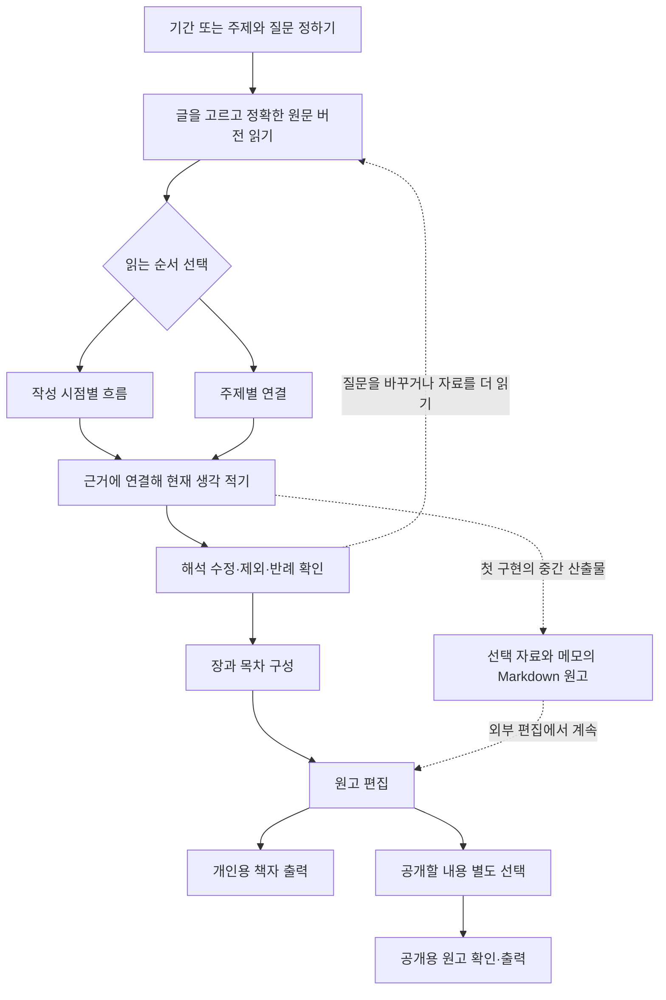

# 기록을 돌아보고 한 권의 글로 엮기

설계일 **2026-10-08 KST**. 사용자의 최신 우선순위는 올해 20대를 마무리하며 지난 글을 돌아보고, 생각의 흐름을 이해한 뒤 ‘20대’ 또는 나이와 무관한 특정 주제의 책자로 엮는 것이다. [기존 자기 이해 설계](lifestyle-blog.md#자기-이해-보고서)를 구체화한다. 이 문서는 목표와 단계별 계약이며 실제 개인 기록 분석·책자 완성·공개 게시를 수행했다는 보고가 아니다.

**첫 단위는 선택한 글을 연도별·주제별로 읽고, 질문과 현재 생각을 적어 Markdown 원고로 꺼내는 흐름이다.** 자동 AI 분석, 여러 책 프로젝트의 저장 모델, 장별 편집기, PDF·인쇄 출력은 이 단위에 포함하지 않는다. 전체 목표를 단순 집계나 파일 다운로드로 축소하지 않되, 첫 구현이 책 제작 전체를 완성했다고 표현하지 않는다.

## 만들고 싶은 결과

책은 자신을 평가하는 성적표보다 **당시의 글과 지금의 해석을 함께 읽을 수 있는 선택된 이야기**다. 반복된 관심뿐 아니라 바뀐 관점, 아직 답하지 못한 질문, 기록에 드러나지 않은 시기도 남길 수 있다. 타인의 글을 저장한 이유가 명시되지 않았다면 동의·취향·신념을 추정하지 않는다.

‘20대’는 첫 사용 장면의 프로젝트 제목·범위다. 생년이나 나이 계산 방식을 추정해 기간을 채우지 않는다. 실제 기간은 사용자가 선택하며, 같은 구조로 ‘일과 쉼’, ‘도시에서 살기’, ‘관계에 대한 생각’처럼 기간 제한 없는 주제를 다룰 수 있어야 한다. 모든 해의 자료를 채우거나 모든 글을 분류해야 시작할 수 있는 설계는 피한다.

흐름은 되돌아갈 수 있다. 시간순으로 읽다가 주제별로 묶어도 원문이나 선택 범위를 바꾸지 않는다. 목차를 먼저 정한 뒤 맞는 글만 끼워 넣는 방식도 강제하지 않는다.

## 전체 목표와 첫 구현의 경계

| 단계 | 최종적으로 필요한 경험 | 첫 구현에서 다룰 범위 |
| --- | --- | --- |
| 프로젝트의 기간·주제·질문 | ‘20대’, 특정 기간 또는 주제로 프로젝트를 만들고 다시 열기 | 기존 회고의 선택 목록과 메모 사용. 질문을 직접 골라 메모에 추가. 기간은 현재 화면 세션의 보기 조건이며 프로젝트에 영구 저장되지 않음. 독립 프로젝트 생성·목록은 후속 |
| 근거 읽기 | 선택한 정확 버전의 원문·발췌·출처를 오가고 시간과 주제로 보기 | 확인된 원 작성 시점 및 선택 원문과 기존 묶음의 교집합을 읽기용으로 정리. 원문을 최신 버전으로 바꾸지 않음 |
| 자기 해석 | 주장·관찰마다 근거와 반례를 붙이고 수정·제외하기 | 현재 메모에 직접 생각을 적고 선택 근거로 돌아가기. 자동 분석이나 구조화된 주장·반례 모델은 후속 |
| 장·목차 | 장마다 질문·선택 구절·원고를 배치하고 순서를 바꾸기 | 연도/주제별 보기와 원고 내보내기만. 화면의 묶음 제목은 저장된 책의 장이 아님 |
| 원고 편집 | 당시 원문·타인 인용·현재 서술을 구별하며 문장을 다듬기 | 기존 메모와 Markdown 파일로 편집을 시작. 파일을 다시 넣으면 책 구조까지 복원되는 기능은 없음 |
| 책자 출력 | 한글 조판·목차·쪽수·주석·이미지 등을 검토해 개인용/공개용 출력 | 읽고 편집할 UTF-8 Markdown 파일. PDF·전자책·인쇄본·공개 게시 완료로 표시하지 않음 |

첫 구현이 끝난 뒤 어떤 글을 뽑아 어떤 장으로 옮기는 데 시간이 많이 드는지 확인한다. **다음 최우선은 특정 주제의 책 프로젝트와 장 구성을 저장하는 단위**이며, 이 체험으로 필요한 모델의 범위를 정한다. SNS 연결이나 자동 수집을 완료해야 회고를 시작할 수 있는 순서로 만들지 않는다.

## 근거·작성자·시간을 다루는 기준

### 원문과 현재 해석

| 내용 | 근거와 표시 | 바뀔 때 보존할 것 |
| --- | --- | --- |
| 당시 내가 쓴 글 | `originalAuthor.relation=self`인 선택 원문. 실제로 직접 쓴 글인지와 가져온 자기 글인지도 기존 출처대로 유지 | `SourceVersion.id`를 고정. 지금의 견해와 같다고 가정하지 않음 |
| 저장한 타인의 글 | 작성자·출처·확보 범위를 표시. 저장 이유가 있다면 현재 메모 또는 당시 메모와 따로 읽음 | 내 발언이나 신념으로 바꾸지 않음. 선택했다는 사실만으로 전체 재게시하지 않음 |
| 작성자 미확인 자료 | 미확인을 그대로 보여주며 저자를 추정하지 않음 | 다른 자료의 작성자 정보를 자동 승계하지 않음 |
| 지금 쓰는 회고 | 현재 사용자가 쓰는 해석·기억·질문. 과거 원문 인용과 문단을 구분 | 원문을 고치지 않는 현재 서술. 근거가 없는 기억도 쓸 수 있으나 원문으로 확인한 사실처럼 표시하지 않음 |
| 후속 AI 제안 | 실행할 때 선택한 근거와 생성 기원, 제안 상태를 표시 | 채택 후에도 AI 기원 유지. 근거 없는 성격 단정·성장 점수·진단은 만들지 않음 |

향후 해석 한 개에는 관찰/해석의 구분, 근거 구절, 다른 설명 또는 반례, 사용자의 수정·제외 상태가 필요하다. 예를 들어 ‘혼자 있는 것을 좋아하게 됐다’는 결론에는 그 방향의 글뿐 아니라 함께하는 시간을 원한 글도 검토할 수 있어야 한다. 글 몇 편의 차이를 성격 변화로 단정하지 않는다. **첫 메모 화면이 이런 구조화된 분석 기능을 갖췄다고 표시하지 않는다.**

발췌는 기존 `{sourceId, sourceVersionId, locator}`와 해당 원문의 UTF-16 `[start,end)` 계약을 따른다. 선택한 옛 버전에 연결된 근거를 최신 버전에서 찾은 것처럼 보이지 않는다. 원문이 누락되면 누락을 표시하고 비슷한 글로 대신 채우지 않는다. URL만 있는 자료는 본문을 읽거나 분석한 근거로 사용하지 않는다.

### 작성일·경험일·가져온 날

- **원 작성 시점:** 원문에서 확인한 `originalCreatedAt`. 연도별 보기의 기준으로 사용할 때 그 의미를 표시한다. 날짜의 해석이 불가능하거나 미상이면 별도 ‘시점 미확인’으로 남긴다.
- **경험 시점:** 글에서 회상하는 사건의 때. 2025년에 쓴 2018년 이야기를 두 날짜 중 하나로 자동 합치지 않는다. 현재 모델에는 독립 경험일 필드가 없으므로 첫 구현은 이를 추출·저장한 연표처럼 표시하지 않는다.
- **가져온/저장한 시점:** 해도에 들어온 때다. 오래된 글을 오늘 가져왔다고 올해의 관심이나 경험으로 집계하지 않는다.
- **현재 회고 시점:** 지금 해석을 적은 맥락이다. 현재 구성 revision이 각 문장의 작성 이력을 보장하지는 않는다.

연도별 자료 수는 선택한 **원문 버전 수**이며 경험·노력·성장의 양이 아니다. 같은 글의 두 버전을 선택하면 두 근거로 표시하되 두 경험으로 세지 않는다. 기록이 없는 해는 실패·공백 인생·관심 상실의 증거가 아니다. 정확한 날짜·분류를 몰라도 글을 선택하고 현재 생각을 적을 수 있어야 한다. 기존 연표 데이터와 계산은 바꾸지 않는다.

### 시간순과 주제별 보기

시간순 보기는 확인한 원 작성 시점을 따른다. 첫 주제별 보기는 **현재 회고에서 고른 버전과 기존 묶음의 버전 목록이 겹치는 범위**를 사용한다. 묶음 제목은 사용자가 정한 연결이며 자동 분석한 주제가 아니다. 발췌 주제 전체를 새로 분석하거나 제목의 단어만으로 심리적 주제를 부여하지 않는다. 한 글이 여러 묶음에 걸칠 수 있고 묶음이 없는 글도 남는다. 같은 글을 여러 곳에서 보여주더라도 원문을 복제하거나 전체 선택 개수를 중복으로 늘리지 않는다.

첫 구현에서 정렬·그룹·기간은 읽기용 보기 조건이다. 기간 선택은 현재 화면 세션에만 유지하며 저장된 책의 범위가 아니다. 프로젝트별 목차·장 배치·근거의 중요도 순서와 동일하게 취급하지 않는다. 보기 전환 때문에 선택 목록·기존 메모가 사라지거나 원문의 날짜·주제가 바뀌면 안 된다.

## 첫 구현: 선택 → 읽기 → 질문 → 메모 → 원고

1. **선택:** 현재 작업공간에서 회고할 원문 버전을 직접 고른다. 자기 글·타인 글·미확인·본문 없음의 실제 범위를 읽을 수 있다. 선택 해제는 이번 회고의 범위를 줄이는 동작이며 원문 삭제나 모든 분석에서의 영구 제외가 아니다.
2. **읽기:** 연도별 또는 기존 주제별로 보고 정확한 원문을 연다. 날짜 없는 글·본문 없는 링크·누락된 참조를 별도로 표시한다. 원문을 읽고 돌아오면 선택과 메모를 이어간다.
3. **질문:** 고정된 짧은 질문을 사용자가 선택했을 때만 메모에 추가한다. 예: ‘그때 중요했던 것은 무엇이었나?’, ‘지금 읽으면 다르게 보이는 부분은?’, ‘이 해석과 맞지 않는 글도 있나?’, ‘다음 글에서 더 묻고 싶은 것은?’ 질문은 분석 결과가 아니며 답을 미리 만들어 넣지 않는다. 기존 글을 지우지 않고 추가하고 한도 초과 시 입력을 보존한다.
4. **메모:** 현재 생각을 자유롭게 쓴다. 필요한 경우 원문 제목·근거 구절을 직접 연결해 적는다. 메모 전체가 특정 원문을 입증하는 주장으로 자동 분해되는 기능은 없다. 자료를 빼도 사용자가 쓴 메모는 자동 삭제하지 않으므로 더 이상 선택되지 않은 근거를 언급하는지 사용자가 검토할 수 있어야 한다.
5. **원고:** 선택한 자료, 읽기 기준, 현재 메모를 UTF-8 Markdown으로 내보낸다. 내보내기에 무엇이 포함되는지 알리고, 선택하지 않은 작업공간 전체 원문을 몰래 포함하지 않는다. 실제 파일 보관·재열기로 완료를 확인한다.

질문·집계가 본문을 밀어내지 않게 기존 회고의 단일 흐름과 공통 컴포넌트를 재사용한다. 상시 큰 분석 대시보드·점수판·새 최상위 메뉴는 필요하지 않다. 연도/주제 전환, 원문 열기, 질문 추가, 원고 내보내기에 접근 가능한 이름을 주고 한글 입력과 읽기의 공간을 우선한다.

### Markdown 원고의 최소 계약

내보내는 것은 개인이 계속 편집할 **원고 재료**다. 목차가 완성된 출판용 책이나 복원 백업과 구분한다.

- 기본값은 **현재 메모와 전체 선택 근거의 출처 목록**이다. 원문 본문은 별도로 선택해 포함한다. 기간·주제 보기를 바꿨다고 전체 선택 목록이 좁아지거나 원고의 범위가 자동 변경된 것처럼 표시하지 않는다. 본문·발췌를 포함하면 포함한 실제 범위와 누락을 함께 표시한다.
- 각 근거에 원천 ID·정확 버전 ID·제목·원저자 관계·원 작성 시점·URL·본문 확보 범위를 유지한다. 구절을 내보낼 때는 실제 위치와 원문을 함께 대조한다. 링크·ID만으로 외부 편집기에서 비공개 앱 원문을 항상 열 수 있다고 약속하지 않는다.
- 원문의 Markdown·HTML·백틱 때문에 파일의 장 구조나 작성자 표시가 바뀌지 않도록 기존 안전한 평문 내보내기 방식을 재사용한다. 원문을 읽기 좋게 바꾸더라도 원본 저장본·발췌 위치를 변경하지 않는다.
- 다운로드는 공개 게시나 외부 AI 전송이 아니다. 개인 메모·원문 URL·타인 인용이 파일에 포함될 수 있음을 범위 표시로 알린다. 공개본은 별도로 고르고 검토한다.
- 원고 파일을 수정해도 앱의 원문·회고·공개 사본은 자동 변경되지 않는다. 앱의 재사용 가능한 보존·사본 복원에는 기존 자료·구성 JSON 백업을 함께 사용한다.

## 현재 모델로 할 수 없는 일

현재 [`Workbench.empty()`·`validate()`](../../assets/life/workbench.js)는 작업공간당 `reflection: {versionIds: [], note: ''}` 한 개를 저장한다. 선택은 최대 1,000개, 메모는 `LIMITS.text`의 20,000 UTF-16 코드 단위이며 전체 구성에는 별도 크기 한도가 있다. 제목·프로젝트 기간·독립 질문 목록·장·주장·반례·문장별 출처·원고 개정 이력은 없다. 이 한도를 책 한 권의 용량으로 약속하지 않는다.

[`renderReflection()`](../../assets/life/workbench-ui.js)의 기존 회고를 확장하는 첫 단위는 같은 작업공간의 회고 하나를 쓴다. ‘20대’와 ‘일과 쉼’을 여러 프로젝트로 동시에 저장·전환하는 기능은 아니다. 내보낸 원고가 있어도 앱 안에 별도 프로젝트가 생성되는 것은 아니다. 새 장 구조를 `note` 문자열의 숨은 JSON이나 기존 페이지 구성 필드로 우회 저장하지 않는다.

후속 프로젝트 모델은 최소한 다음 논리 단위를 비교해야 한다. 이는 지금 확정한 DB 스키마나 마이그레이션이 아니다.

| 후속 단위 | 필요한 이유 |
| --- | --- |
| 회고/책 프로젝트 | 고유 ID, 제목, 선택 기간 또는 주제, 질문, 포함/제외 근거, 개정 상태를 다른 프로젝트와 분리 |
| 근거에 연결한 해석 | 관찰·현재 서술·AI 제안의 기원, 정확한 원문 구절, 반례, 수정·제외 상태를 문장 수준으로 구분 |
| 장·목차 | 장의 질문·순서·원고와 선택 근거를 보존. 같은 근거를 여러 장에 참조해도 원문은 하나 |
| 원고 개정·출력 사본 | 편집 중 원고와 확정 출력본을 구분하고 사용한 정확 버전·포함 범위를 추적 |
| 개인용/공개용 범위 | 같은 프로젝트라도 독자에게 보여줄 서술·인용·이름·출처를 별도 선택 |

이 모델을 추가할 때 계정/작업공간 경계, 기존 회고를 잃지 않는 이전, 구성 동기화 충돌, JSON 백업·새 사본 복원, 원문 제외·삭제 이후의 파생 내용 처리를 함께 설계한다. 현재 선택 해제나 로컬 메모 하나를 이 전체 계약의 구현으로 표현하지 않는다.

## 왜 처음에는 기존 Markdown인가

[기존 오픈소스 조사](open-source-review.md)의 2026-10-03 자료 가져오기 비교와 2026-10-05 직접 글쓰기 비교를 재사용했다. 당시 검토한 Obsidian Importer·SilverBullet의 평문 파일 활용, CodeMirror·Tiptap/ProseMirror의 편집 경계는 참고 자료이며 이번에 최신 릴리스나 라이선스를 새로 확인한 결과가 아니다. **이번 설계에서는 새 패키지를 선정·설치하지 않았고 외부 네트워크 조사도 하지 않았다.**

기존 [`Core.toMarkdown()`](../../assets/life/core.js)은 원문·버전·발췌·출처를 읽기용 문서로 내보내고 JSON 복원 백업과 구분한다. 이 함수는 작업공간 전체 내보내기이므로 그대로 호출한 결과를 ‘선택 회고 원고’로 표시하면 안 된다. 선택 범위와 메모를 직렬화할 때 기존 평문 보존·출처 표시 계약을 재사용한다. 새 Markdown parser나 리치 편집기 없이도 텍스트 파일에서 계속 편집할 수 있는지 먼저 확인할 수 있다.

한글 조판·쪽나눔·각주·이미지·목차·폰트 포함·인쇄 여백은 Markdown 다운로드만으로 해결되지 않는다. 실제로 장을 엮는 요구가 확인되면 문서 변환·출판 도구의 최신 공식 배포·라이선스·유지관리·한글 출력·로컬 처리 적합성을 비교하고 작은 원고로 검증한다. 아직 PDF 도구나 출판 엔진을 채택하지 않는다.

## 최소 실험과 완료 기준

개인 계정 자료 대신 익명 샘플로 **내 글 두 편, 저장한 타인 글 한 편, 날짜 없는 글, 링크만 있는 자료, 같은 글의 옛/새 버전**을 준비한다. 서로 다른 견해가 담긴 글을 포함한다. 연도별 선택 → 주제별 재검토 → 정확한 옛 원문 열기 → 질문 추가 → 메모 → 원고 다운로드 → 재열기까지 한 번에 체험한다.

| 확인 영역 | 첫 단위의 완료 조건 |
| --- | --- |
| 근거와 시점 | 정확 버전·작성자·확보 범위가 UI와 파일에서 맞음. 가져온 날로 원 작성일을 채우지 않으며 시점 미확인 자료가 사라지지 않음 |
| 보기 전환 | 연도/주제 전환이 선택·메모·원문을 바꾸지 않음. 중복 주제 노출을 경험 횟수로 집계하지 않음 |
| 질문과 입력 | 사용자가 고른 질문만 기존 메모 뒤에 추가. 질문 연속 선택·한글 조합·한도 도달·저장 오류에서도 입력을 잃지 않음 |
| 선택·제외 | 자료를 빼면 선택 근거와 다음 원고 범위에 반영. 원문이나 독립 메모를 자동 삭제하지 않음. 구조화되지 않은 메모의 인용이 자동 갱신된 것처럼 표시하지 않음 |
| 저장·복구 | 새로고침·재열기·계정 전환에서 기존 저장 계약을 유지. 자료·구성 JSON 백업의 새 사본 복원 후 선택 근거를 정확히 다시 연결 |
| 원고 파일 | 선택 범위·메모·출처·버전·누락을 확인하며 선택 밖 원문이 없음. 한글·emoji·빈 줄·백틱·HTML 모양의 원문을 재열어 대조. JSON과 PDF로 오인시키지 않음 |
| 사용 흐름·시각 | 1440·820·390px에서 본문 읽기·원문 복귀·질문/내보내기 조작 가능. 키보드·터치 대상·긴 제목·빈/오류 상태를 확인하며 실제 Apple 기기와 크기 모사를 구분 |

자동 검사는 입력·출처·보존을 확인한다. **사용자가 과거 글과 현재 생각을 연결하기 쉬워졌는지, 이 파일로 한 편의 글을 계속 써볼 수 있는지**는 별도 체험 결과로 판단한다. 파일이 생성되거나 질문 수가 늘었다는 이유만으로 자기 이해가 깊어졌다고 보고하지 않는다.

첫 체험에서 외부 파일과 앱 사이의 장 편집이 끊기면 프로젝트·장 저장을 다음 단위로 올린다. 근거를 읽는 것보다 질문이 방해되면 질문을 접고 직접 메모를 우선한다. 의미 있는 차이를 찾기 어렵다면 자동 분석을 먼저 더하지 않고 선택 범위·질문·원문의 충분함부터 조정한다. 기능 검사, 사용성·시각 검토, 실제 사용자 체험, 공개 배포는 각각 별도 결과로 기록한다.
