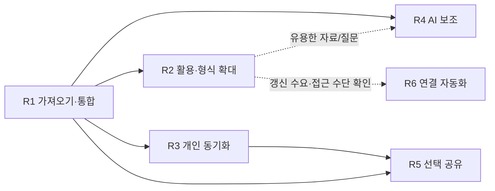

# 구현 로드맵과 에이전트 작업 배치

2026-10-03 · 설계 v2. 사용자의 후속 요청으로 R1의 첫 로컬 구현을 마쳤다. [구현 기록](r1-implementation.md)에 실제 검증과 남은 범위를, [구현 계약](implementation-contract.md)에 API를 정리했다. 아래 전체 단계나 Apple 실기 검증이 완료됐다는 뜻은 아니다.
사용자가 처음 얻을 결과는 **여러 곳에 이미 남긴 기록을 가져와, 필요한 구절과 출처를 연결하고 다시 찾는 흐름**이다.
원천은 Apple 메모·Obsidian·네이버 블로그·인스타그램, 사용 환경은 Mac·iPad·iPhone이다. iPad Chrome은 기존 확인 환경이며 다른 기기의 브라우저·OS 버전은 실기 검증 때 기록한다.
직접 기록은 보완 역할로 바꾸며, 이전의 오늘/빠른 활동 기록 중심 R1을 대체한다.
전체 영역은 [통합 설계](README.md), 검증 ID는 [검증 기준](validation.md)을 따른다.

후속으로 공용 인증·개인 동기화를 [통합 브랜치](../supabase-integration.md)에 연결했고, R2의 [여러 TXT·Markdown 파일 검토](r2-implementation.md)와 [검색에서 일치한 원문 버전·구절을 열고 목록으로 복귀](r2-search.md)를 구현·검증했다. [PR #19](https://github.com/wonchance-art/life-haedo/pull/19)와 공용 인증 PR #17은 병합되었다. Google 제공자·콜백 설정과 Mac 실제 로그인은 인계로 확인했고 사용자가 정상 작동을 확인했다. 주제별 활용·서비스별 adapter 등 R2 전체와 Apple 기기의 자료 입력·선택·Files 검증은 별도 남은 범위다.

## 현재 우선순위 — 기록·도구·관리 통합 홈

2026-10-04 후속 요청으로 LPE 연결은 보류하고 해도 자체의 통합 홈을 먼저 구현했다. PR #20·#21·#22는 병합·배포됐으며 아래의 과거 PR 대기 문구는 당시 기록이다. 전체 디자인은 [Life 기준 사이트 재구성](../design-review/life-design-site.md), 이번 관리 하위 흐름은 [보관·복원·동기화 기록](../design-review/life-management.md)을 따른다. 연표 값·계산은 유지한다.

1. **통합 홈:** 로그인 후 기록 피드를 바로 열고 자료·연표를 같은 기록 메뉴에 묶는다. 목표·습관은 도구, 계정·공간·동기화·백업은 관리에서 연다. 기존 인증·저장 계약과 URL은 유지한다. [이번 구현·검증](../design-review/unified-home.md).
2. **보관·복구의 안내 개선:** JSON 미리보기·취소·새 사본·이전 공간 복귀와 상태별 동기화 행동을 구현하고, 설치 후 조회 실패·낡은 충돌 비교·전환 중 초안 보존을 검증한다. [이번 결과](../design-review/life-management.md)에 기능·시각·실기 상태를 구분한다. 저장 스키마·백업 형식은 통합하지 않는다.
3. **Apple 실기:** 공개 화면에서 한글 IME·구절 선택·Files와 앱 전환 복귀를 실제 기기로 확인한다. 브라우저 폭 검사를 실기 통과로 대체하지 않는다.
4. **입력 편의·연결 확대:** 가장 번거로운 원천 하나부터 작은 단위로 진행한다. LPE 자료·코드·외부 DB는 이번 범위에 들이지 않는다.

디자인 책임은 root, 공통 HTML/탐색은 unified_shell, 인증·경계 리뷰는 management_plan, 기능/시각 검증은 sequence_review가 맡았다. 새 라이브러리·마이그레이션은 추가하지 않는다.

## 이전 우선순위 — 실제 자료 화면 디자인 통합

사용자의 2026-10-04 후속 승인으로 기능 확대에 앞서 아래 순서로 진행한다. 디자인 책임자 root가 한 열 본문·공통 아이콘·활자·간격을 통합하고 여섯 담당이 화면, 컴포넌트, 배포 구성, 기능 회귀, 시각 검토, 문서·독립 검토를 분담한다. 모델/effort를 별도로 변경하지 않고 현재 팀 설정을 상속한다.

1. **검색·원문 한 흐름**: 승인된 A 인용 아이콘과 본문 중심 한 열을 검색 → 일치한 원문 열기 → 발췌 저장 → 목록 복귀에 연결했다. 이번 단위의 로컬 검증을 완료했다. 공개 적용은 [PR #20](https://github.com/wonchance-art/life-haedo/pull/20)의 결과를 따른다. [구현·검증 기록](../design-review/integration.md).
2. **가져오기·발췌·주제 모음 — 로컬 완료**: 본문/파일/링크 구분과 검토·입력 수정, 인용/내 메모/원문 버전의 구분, 주제별 개수·미분류·조건 해제를 같은 규칙으로 정리하고 로컬 검증을 완료했다. [이번 범위·검증](../design-review/collections-integration.md). 시간 보기·동기화·백업/복원의 별도 정보 구성 개선은 포함하지 않는다.
3. **상태·접근성**: 긴 제목·많은 자료·빈/로딩/오류와 키보드·터치·대비·한글 줄바꿈을 확인한다. 첫 흐름의 해당 검사는 1번에 포함한다.
4. **기존 기능 보존**: 저장·로그인·동기화·백업·원문 참조를 확인한다. UI 통합마다 관련 회귀를 수행하며 마지막에만 미루지 않는다.
5. **실제 기기 확인·공개 적용**: Mac/iPad/iPhone의 선택·한글 입력·Files를 브라우저 크기 검사와 구분해 확인한다. 공개 적용 결과는 [피드 마감 기록](../design-review/feed-refinement.md)과 PR #20에서 확인한다.
6. **자료 통합 확대**: Apple 메모·Obsidian 입력 편의, 블로그·인스타그램의 출처 정리, 자료 간 연결을 실제 사용 결과에 맞춰 확장한다.

## 다음 작업 설계 — 보관 상태와 복구를 이해하는 첫 사용

2026-10-04 KST · 설계만 갱신. 기준 코드는 `e96fed5`이며, 이번 조회에서 PR #20은 CI 통과·초안·미병합 상태였다. 아래는 다음 실행 계획이며 앱 수정·배포·실기 검증을 수행했다는 뜻이 아니다.

목표는 **가져온 자료가 어디에 보관되어 있는지 이해하고, 다른 기기에서 이어 읽거나 백업으로 복구할 수 있게 하는 것**이다. 현재 읽기·가져오기 흐름의 실제 사용 확인과 후속 관리 화면 개선을 분리해 완성된 변경의 공개 적용을 계속 늦추지 않는다.

후속 시각 지시: 각 자료·발췌를 독립된 피드로 구분하고 SNS처럼 단순한 구성을 유지한다. 본문 밖의 반복 텍스트는 줄여 기존 문양과 동일한 선·크기·정렬의 아이콘으로 표시한다. 읽기 판단·실패 복구에 필요한 짧은 정보와 접근 가능한 이름은 유지한다. 이 피드 보정은 현재 디자인의 마감 범위이며 B의 관리 기능 확대와 구분한다.

### 순서와 작업 경계

| 순서 | 작업 | 종료 결과 |
| --- | --- | --- |
| A 현재 완성본 적용 | PR #20의 범위를 고정하고 발견된 차단 결함만 보완한다. 기존 배포 승인 범위에서 병합·Pages 적용 후 라이브 로그인·새 UI·기존 캐시 업데이트를 확인한다. | 사용자가 실제 기기에서 현재 디자인을 열고 체험할 수 있음. 배포와 실기 통과는 별도로 기록 |
| B 다음 개발 묶음 | 자료 관리 → JSON 백업/새 사본 복원 → 동기화 상태·다음 행동을 정리한다. 화면 설계와 익명 샘플 준비는 A와 병렬로 할 수 있으나 구현은 별도 변경 묶음/PR로 관리한다. | 현재 공간의 보관 범위를 이해하고 원문 포함 백업·복원·원본 재방문을 완료 |
| C 실제 입력 부담 줄이기 | Mac/iPad/iPhone 체험에서 가장 번거로운 원천 한 개를 고르고 실제 내보내기 샘플과 공식 도구를 비교한다. Apple 메모·Obsidian의 텍스트 전달 경로를 첫 후보로 둔다. | 지원 형식·포함/누락 범위·개선할 사용자 행동이 확인된 작은 입력 개선 |
| D 가치 확인 후 확장 | 원문 간 연결과 시간 탐색의 필요를 실제 자료로 확인한다. | 유용성이 확인된 기능만 별도 구현 단위로 착수 |

시간 보기 확대는 A/B의 완료 조건으로 두지 않는다. 현재 `renderTime()`은 계정별 기존 연표를 별도 화면으로 여는 목록이다. 새 자료의 시간축을 만들려면 원문 작성일·가져온 시각·경험일을 구분하는 별도 설계가 필요하다. 부분 날짜 `2023`을 1월 1일로 바꾸거나 작성일 미상을 가져온 날짜로 채우지 않는다. 처음 필요가 확인되면 최근 가져온 자료 정렬부터 검토한다.

### B의 화면 구성

1. **자료 관리:** 현재 작업공간과 자료·발췌 개수, 이 브라우저 보관 상태, 서버 동기화 상태를 짧게 표시한다. `백업·복원`과 `기기 간 동기화`를 주요 경로로 두고 기존 연표·빈 공간 생성·계정 연결 전 자료 가져오기는 추가 도구에 둔다. 기존 최소 아이콘 탐색과 A 인용 도형은 유지한다.
2. **백업·복원:** 복원 가능한 JSON 백업을 먼저, Markdown을 읽기용 문서로 구분한다. 현재 공간의 확정 원문·발췌·메모·출처를 포함하고, 미적용 검토 초안·미보관 첨부·기존 연표 등은 제외됨을 다운로드 전에 알린다. 복원은 파일 선택 → 제목·개수·범위 확인 → 새 사본 생성 → 원본 공간으로 돌아가기 순서다.
3. **동기화:** 현재 상태와 가능한 행동을 먼저 제시한다. 계정 상세·프로젝트·revision·SQL 도움말은 접는다. 미연결/중지/대기/전송/동기화됨/실패/계정 불일치/충돌을 구분하고, 로그인만으로 전송하지 않는 기존 동작을 유지한다. 서버와 동기화됨은 다른 기기에서도 최신 화면이 열렸다는 증거로 표현하지 않는다.
4. **충돌:** 내 변경과 서버 변경을 동등하게 비교하고 선택하지 않은 쪽의 사본 보존을 명시한다. 새 diff 엔진 없이 현재 원문·발췌·메모의 비교와 접기 구성부터 정리한다.

별도 백업 이력 DB나 새 저장 스키마는 필요하지 않다. 실제 제공되는 동기화 상태만 표시하고, 없는 마지막 성공 시각이나 다른 기기의 수신 여부를 만들어 표시하지 않는다. 파일 다운로드 요청과 사용자가 Files에 보관한 사실도 구분한다. 현재 DOM·CSS·네이티브 details와 Lucide를 재사용하며 새 라이브러리는 제안하지 않는다. C에서 adapter가 필요해질 때 기존 [오픈소스 검토](open-source-review.md)를 최신 공식 릴리스·라이선스·지원 플랫폼 기준으로 갱신한다.

### 완료 조건과 반대 검토

- 익명 원문 2개와 서로 다른 버전의 발췌를 JSON으로 내보내 새 공간에 복원하고, 정확한 원문 위치와 메모를 확인한다. 원래 공간은 그대로 남고 새 사본은 자동 동기화되지 않아야 한다.
- 잘못된 JSON·지원하지 않는 형식·저장 공간 부족·복원 실패 시 기존 자료를 보존한다. 연속 파일 선택의 기존 busy 보호를 검토하고 실제로 오래된 파일 결과가 노출되는 경우에만 재현 검사와 수정으로 이어간다. 코드 읽기만으로 경합 버그가 있다고 확정하지 않는다.
- 계정 전환·전송 재시도·오프라인·서버 자료 없음·충돌 중 재변경에서 상태와 가능한 행동을 대조한다. 검토 초안의 기기별 보관, 조건부 쓰기, 원문 버전·UTF-16 위치, 백업 형식은 기존 계약을 유지한다.
- 1440·820·390px의 긴 공간 이름·빈 목록·로딩·오류·복원 미리보기·충돌을 실제 브라우저에서 검토한다. 기존 회귀와 새 화면/초점 검사를 분리하고 변경에 해당하는 검사만 실행한다.
- 기능 회귀와 시각 검토는 통과 여부를 각각 남긴다. 새 결함이 없다면 추가 시안·전체 재검사를 반복하지 않는다.

핵심 반대 질문은 **관리 화면을 읽기 전에 배워야 하는가**, **다운로드나 서버 상태를 실제 보관/기기 수신으로 오해하는가**, **새 기능 때문에 완성본 체험이 늦어지는가**다. 관리와 JSON 복원만으로 충분하면 동기화는 문구·위계 보정으로 끝내고 상세 비교 확대를 분리한다.

### 실제 기기 체험

실기에 접근할 수 있는 실행 주소를 먼저 확보한다. Cloud localhost를 외부 체험 링크로 안내하지 않는다. Local의 Mac 실행을 활용할 수 있으면 먼저 확인하고, 그 주소로 열 수 없는 iPad/iPhone은 공개 적용 뒤 라이브에서 이어 확인한다. 실제 기기에 접근하지 못한 항목은 미검증으로 남기며 브라우저 폭 검사로 대체 완료하지 않는다.

1. iPad Chrome에서 익명 Apple 메모 본문과 Files의 TXT/MD를 가져오고 한글 입력·앱 전환 후 초안을 확인한다.
2. iPad의 세로·가로·분할 화면에서 터치로 구절을 선택하고 발췌한 원문 위치로 돌아간다.
3. Mac에서 한글 메모를 보완하고 검색·과거 버전·목록 복귀·새로고침·재방문을 확인한다.
4. 선택한 공간만 명시적으로 동기화해 iPhone에서 확정 자료를 연다. 다른 기기의 미확정 초안이 전송됐다고 표시하지 않는지 확인한다.
5. iPad Files에 JSON을 실제 보관하고 Mac에서 새 사본으로 복원해 원문·출처·발췌를 대조한다.

기기·OS·브라우저 버전, 완료/실패/미검증을 기록한다. 이 체험에서 관찰한 입력 부담과 읽기 중단 지점이 C의 우선순위를 결정한다.

### 다음 구현의 담당 배치

총괄 root가 공통 CSS·디자인 판단·통합 순서를 맡는다. 여섯 담당의 모델/effort는 현재 팀 설정을 상속한다. 같은 `ui.js`를 여러 명이 동시에 편집하지 않는다.

| 담당 | 독점 작업/검토 경계 |
| --- | --- |
| 제품 UI | `assets/life/ui.js`의 관리·백업·동기화 표시와 초점 |
| 저장·동기화 계약 | 기존 core/storage/sync 읽기 검토와 자료 보존·실패 사례. 엔진 수정은 재현된 결함에 한정 |
| 기능 회귀 | 새 관리 흐름 브라우저 검사와 영향받은 기존 회귀 |
| 시각·접근성 | 화면 상태별 캡처·폭/대비/한글/키보드/터치 검사 |
| 배포·업데이트 | 최종 산출물·SW 업데이트·PR/배포 증거 |
| 독립 검토·인계 | 실제 기기 시나리오·기능/시각/배포 상태 대조·문서 |

계약 확정 → UI/CSS 구현과 검사 준비 병렬 → 기능·시각 통합 확인 → 산출물·업데이트 확인 순서다. 담당 작업이 끝나면 발견된 실패나 다음 원천의 구체적인 불확실성을 맡기며, 인원을 채우기 위한 새 기능은 추가하지 않는다.

## 단계와 의존성

단계는 기간 추정이 아니라 유용한 동작과 검증의 묶음이다. 데이터 보존·실패 복구까지 확인해야 완료다.
각 단계에서 필요한 [오픈소스 비교](open-source-review.md)를 최신 공식 근거로 갱신하고 직접 도입·일부 재사용·설계 참고·자체 구현을 비교한다.
전체 플랫폼·모든 파일 형식·전 분야 입력 도구를 먼저 만들지 않는다.

| 단계 | 사용자에게 생기는 기능 | 주요 작업 | 완료 증거 |
| --- | --- | --- | --- |
| R1 기존 기록의 로컬 통합 | 선택 자료 가져오기 → 원문 확인 → 발췌/연결 → 모아보기 → 재열기·내보내기/복원 | 최소 입력 형식·원문 버전·출처 위치·검토 재개·중복 판정·원자 저장·기존 연표 읽기 | 가져오기 전용 V-18~27과 V-06/07/14/15 및 V-13/17의 해당 로컬 부분 |
| R2 주제·분야별 활용과 입력 확대 | 책·장소·질문·창작 등으로 같은 자료를 찾고 생각의 변화 비교 | 가치가 확인된 모음부터, 서비스별 내보내기 adapter·내부 링크/첨부·선택 구조화 순차 확대 | DOM-01~09 해당 장면, 원천별 실제 샘플·원문 추적·분야별 오해/누락 검사 |
| R3 새 자료의 개인 동기화 | 다른 기기에서도 확정한 원문·발췌·모음을 이어봄 | 원격 소유권·수신 범위·조건부 쓰기·삭제 표식·충돌·계정 전환; 미적용 검토·첨부는 후속 | V-07/12/13/14의 새 원격 모델 검사, 두 계정 격리·응답 유실 대조 |
| R4 근거가 있는 AI 보조 | 선택 자료에서 생각·질문·관계 후보를 추출하고 깊은 대화 | 출처 고정·인용·의미 추출 평가·후보 비교·되돌리기·전송 범위/비용 | V-08/09/12와 원문/화자/부분 수집 검증; AI 없이 기본 흐름 완료 |
| R5 선택적 공유 | 선택 모음의 읽기 사본, 후속 방문형 서재 | 원문과 공개 가능 범위 구분·공유본·미리보기·수신자 권한·철회 | V-10~12/16/17, 비수신자 직접 요청·검색·캐시·출처/공개 범위 검사 |
| R6 필요한 연결 자동화 | 실제 필요가 확인된 원천 갱신·반복 작업 | 공식 API/권한·추가/변경/삭제 감지·중복 방지·중단·결과 대조 | 재시도·부분 성공·원천 삭제·권한 철회·결과 불명 주입 검사 |

여러 기기 사용이 확인됐으므로 R1 뒤에는 R3 개인 동기화를 분야별 확장보다 우선한다. R1 백업 사본 이동은 임시 이동 수단이며 자동 동기화가 아니다.
R3의 실제 구현·서버 설치·검증 상태는 [개인 동기화 구현 기록](r3-implementation.md)을 따른다. 확정하지 않은 가져오기 검토는 첫 동기화 범위에서 제외해 기기마다 입력 중인 초안을 보존한다.
R2 전체 완료가 R3/R4의 조건은 아니다. R4의 의미 추출은 작은 별도 실험으로 일찍 비교할 수 있지만 R1 저장을 AI에 의존시키지 않는다.
R5는 R3의 서버 소유권·삭제 계약을 재사용하며 AI 완료는 요구하지 않는다.
R2의 분야별 깊이는 실제 가져온 자료에서 정한다. 책/교재 전용 진도 도구를 모든 사용자 흐름의 선행 조건으로 두지 않는다.
R6 자동 연결과 외부 게시/메시지 실행은 별도 권한이다. 한 원천의 읽기 연결을 허용했다고 외부 쓰기를 허용한 것은 아니다.

## 첫 구현 묶음 R1

### 범위와 첫 사용 장면

최소 파일 입력은 **UTF-8 텍스트·Markdown**, 보조 입구는 **선택 본문 붙여넣기·링크 등록**으로 제안한다.
네 원천의 전용 내보내기·ZIP·PDF·사진 OCR은 기본 파서 지원으로 간주하지 않는다. URL만 있으면 본문 미확보 상태로 남긴다.
첫 작은 실험에서 익명 샘플과 iPad 파일/복사 경로를 확인해 지원 형식·크기 한도·누락 범위를 구체화한다.
첨부한 구상 대화 ZIP은 설계 참고 사례이며 네 원천을 대신하는 첫 수집 대상으로 정하지 않는다.

| 장면 | 시작과 입력 | 사용자가 얻는 결과 | 확인할 부담·실패 |
| --- | --- | --- | --- |
| 생각을 모으기 | Apple 메모에서 선택한 본문과 Obsidian Markdown에 같은 책에 대한 서로 다른 생각이 있음 | 필요한 구절을 한 모음에 연결하고 각각의 원문 버전·위치로 돌아감 | 재입력·무조건 같은 생각으로 병합·전체 글 검토 강요 |
| 경험과 관심 구분하기 | 네이버 블로그의 방문 글, 인스타그램의 관심 장소 링크·제공 캡션 | 같은 장소로 찾아보되 방문 경험과 관심 표시를 구분 | URL을 본문 확보로 오인·남의 글을 자기 경험으로 확정·미디어 누락 은폐 |
| 다시 가져오고 복구하기 | 같은 파일 재제출, 일부 수정된 원문, 검토 도중 종료, 백업 후 새 작업공간 복원 | 중복 적용 없이 변경을 비교하고 검토/모음을 다시 열며 받은 원문까지 복원 | 버전 덮어쓰기·절반만 적용·깨진 발췌 위치·백업에 링크만 남음 |

실제 사용 대상은 Mac·iPad·iPhone이다. iPad Chrome 외 브라우저·OS 버전과 평소 여는 경로는 실제 검증 때 기록한다.
실기 접근 전에는 에뮬레이션만으로 파일 선택·복사·백업 보관·재방문을 통과했다고 표시하지 않는다.

### 불확실한 선택을 확인하는 실험

| 질문 | 최소 실험 | 선택·변경 조건 |
| --- | --- | --- |
| 원천에서 필요한 내용을 실제 꺼낼 수 있는가 | 네 원천별 익명 글 하나씩 파일/선택 복사/링크 경로로 전달해 본문·출처·날짜·첨부 포함 범위를 비교 | 본문을 못 얻으면 링크만 처리하고 입력 지원을 축소·명시. 자동 연결을 해결됐다고 보고하지 않음 |
| 원문 대조와 검토가 편한가 | iPad 세로·가로·분할 화면에서 필요한 두 구절만 모으고 원문으로 복귀 | 화면 이동·복사 횟수·읽기 위치 손실을 줄임. 검토하지 않은 전체 내용까지 적용하지 않음 |
| 기존 검색보다 나은가 | 이미 흩어진 같은 샘플에서 기존 앱 검색/수동 모음과 R1으로 특정 질문의 근거를 찾고 며칠 뒤 다시 확인 | 탐색 시간·재설명·검토 비용을 비교. 이득이 없으면 구조화/후보 수를 줄이고 모음의 목적을 조정 |
| 저장·중복·버전 처리가 성립하는가 | idb 후보로 원문/항목/참조/영수증 원자 적용, 같은 입력 재시도, 새 버전, 두 탭·공간 부족·업그레이드 시험 | 부분 반영이 없어야 함. 복잡한 버전 이전 등 실제 요구가 나오면 Dexie와 비교 |
| 앱 밖에서도 자료를 보존하는가 | 원문 포함 백업→일반 도구로 읽기→격리 프로필 데이터 제거→새 사본 복원 | 발췌·원문·참조 복원, 포함하지 않은 첨부 표시. iPad에서 파일 보관·재선택도 실제 확인 |

공식 Obsidian Importer의 Apple Notes 이동은 macOS 전용이라는 확인 결과를 반영한다. 이를 iPad 연결 경로로 제안하지 않는다.
나머지 서비스별 내보내기의 기기/버전 제약과 조사 미확인 사항은 [오픈소스 검토](open-source-review.md)에 기록한다.
실험 결과는 질문·후보 버전·샘플/환경·관찰·결정·미검증·재검토 조건으로 짧게 남긴다. 아래 설계 실험의 실제 수행 범위는 구현 기록에서 따로 보고한다. 기기 화면 모사는 Apple 실기 검증이 아니다.
착수·통합 결과·새 피드백 때 [반대 관점 점검](validation.md#착수-전-가정과-반례)을 갱신하며 새 근거 없는 반복 검토로 진행을 막지 않는다.

### 구현과 인계

1. **작은 입력 계약과 샘플**: 원문 제목/식별 단서·제공 범위·본문·화자/저자·시각·링크·locator를 정의한다. 일부만 복사한 글, 같은 파일, 수정판, 타인 인용, 미디어만 있는 링크를 포함한다.
2. **받은 원문과 검토 보관**: Source/SourceVersion과 ImportSession을 분리한다. 파일 내용은 실행하지 않으며 크기·형식 오류와 누락을 명시한다. parser 출력과 AI 추론을 구분한다.
3. **최소 검토와 통합**: 자료만 보관하거나 구절을 선택해 모음에 연결한다. 자료만 먼저 확정했다면 후속 발췌·연결은 같은 원문 버전을 참조하는 새 작업이다. 검토 취소로 이미 보관한 원문을 삭제하지 않는다. 중복/새 버전/내용 겹침을 구별하고 동일 경험 여부는 사용자 확인 없이 확정하지 않는다.
4. **원자 저장과 복원**: 선택된 결과·근거 참조·성공 영수증을 `commitLocal`로 함께 저장한다. 충돌 시 검토 선택을 유지하며 백업 복원은 자료 가져오기와 별도 경로에서 사본으로 수행한다.
5. **다시 찾기와 원문 이동**: 모음·검색·시간 보기에서 받은 원문 위치와 원앱 링크를 구별해 연다. 자료 검토 재개를 Activity의 수행 재개와 섞지 않는다. 기존 연표는 읽기 연결부터 제공한다.
6. **iPad·PWA 통합**: 파일 앱·붙여넣기·긴 글 대조·보완 메모·앱 전환·재시작을 확인한다. 구버전 탭/DB 업그레이드·오프라인·저장 실패를 검사하고 데스크톱·390px로 보조 확인한다.

R1 백업은 새 생활 도구 데이터와 받은 원문을 대상으로 하며 기존 연표 백업과 범위를 구분한다.
내보내기는 JSON의 schemaVersion·포함 범위·첨부 누락을 명시한다. 모음을 읽을 수 있는 텍스트/Markdown 내보내기는 정식 복원 백업과 구분한다.
이 브라우저에 저장됨, 파일 다운로드 요청됨, 사용자가 별도 백업을 보관함은 서로 다른 상태다.
R1은 원격 전송·서지 API·AI·특정인 공유 없이 성립한다. 자동 수집 대신 수동 제공 경로부터 쓰되 이후 adapter를 붙일 수 있도록 원천 계약을 남긴다.

## 팀 구성과 모델/effort

이번 설계에는 총괄 1명과 전문 담당 6명을 배치했다. 모델/effort는 작업별 설정이며 저장소 전역 설정 변경을 뜻하지 않는다.
다음 구현에서도 같은 책임을 활용하되 독립 파일·계약이 준비된 작업만 병렬로 진행한다.

| 담당 | 모델 | effort | 이번 설계 산출물 | 구현 시 책임 |
| --- | --- | --- | --- | --- |
| 총괄·통합 | GPT-6 Astra | xhigh | README·로드맵·공통 결정 | 범위·인터페이스·충돌 조정·통합 결과 확인 |
| 분야 도구 | GPT-6.1 Sol | high | domains.md | 주제/경험의 연결 의미, 원천별 샘플·분야별 해석 규칙 |
| 화면·경험 | GPT-6.1 Sol | high | experience.md | 가져오기/출처 대조/모아보기, iPad·검토 재개·오류 표현 |
| 데이터·권한 | GPT-6 Astra | xhigh | data-model.md | 원문 버전·발췌 위치·중복·원자 적용·복원·원격 권한 |
| AI·자동화 | GPT-6 Astra | high | ai-workflows.md | 자료/제안 계약·출처·선택 전송·취소/실행 상태 |
| 기술 구조 | GPT-6.1 Sol | high | architecture.md | 원천별 도입/OSS 조사·parser 경계·legacy·PWA 통합 |
| 독립 검증 | GPT-6 Astra | high | validation.md | 반례·교차 검토·격리 브라우저·변경별 검증 증거 |

데이터·권한과 총괄은 저장/삭제/복원처럼 여러 경계를 함께 판단해야 해 xhigh를 배치했다.
범위가 분명한 분야·화면·구조 구현에는 Sol high, 출처·권한·예외 검토에는 Astra high를 배치했다.
모든 작업을 최고 effort로 올리기보다 계약·반례가 해결되지 않는 작업의 effort를 올린다. 속도·비용 우위는 실측 전 보장하지 않는다.
위 팀은 개발 작업 팀이며, 제품 안에서 일곱 모델을 상시 실행하는 설계가 아니다.

## R1 작업 배치와 통합 순서

| 묶음 | 주 담당 | 독점 수정 경계 예시 | 시작 조건과 인계 |
| --- | --- | --- | --- |
| A 원문·발췌·연결 계약 | 분야 + 총괄 | `core.js`는 분야 담당 한 명, 총괄은 리뷰 | 데이터·화면·parser 담당이 SourceVersion/locator/changes/검토 상태 합의 |
| B 로컬 원문·검토 저장·복원 | 데이터 | `storage.js`, 저장 회귀 | A 계약 후 시작; UI mock과 동일한 commitLocal 결과 |
| C 가져오기 검토·모아보기 | 경험 | `ui.js`, `ui.css` | A 이후 mock으로 병렬 진행, 원문 대조·부분 선택·재방문 구현 |
| D 입력 adapter·기존 앱·셸 | 기술 | parser/adapter, `shell.js`, `legacy.js`, `index.html`, `sw.js` | A의 원문/누락 계약에 맞춘 최소 형식; 전역 파일은 단독 담당 |
| E 실패·추적·보존 검증 | 검증 | 검사 파일·재현 기록 | A부터 반례 작성, B/C/D 통합 후 입력/참조/복원을 실제 대조 |
| F 해석과 근거 검토 | AI | 후속 계약·익명 샘플 | AI 코드 없이도 원문/추론/화자 오인 점검; 끝나면 후속 독립 작업까지 대기 가능 |

파일명은 [기술 구조](architecture.md)의 제안이다. 실제 생성 전 소유자를 고정하고 같은 파일을 동시에 수정하지 않는다.
이번 설계에서도 총괄은 통합 문서, 각 전문 담당은 담당 문서만 수정한다. 인원을 채우기 위해 AI·연동·프레임워크를 추가하지 않는다.
각 담당은 오픈소스 비교를 책임지고 기술 담당은 통합·배포·업데이트 비용을, 검증 담당은 근거·반례를 대조한다.
통합 순서는 원천 샘플/OSS 적합성 확인 → A 계약 → B/C/D 병렬 → 실제 저장 연결 → E 실패/회귀 → 전체 사용 흐름 확인이다.
화면·parser·저장 계층이 서로 다른 지원 범위나 성공 상태를 기대한 채 각각 완료로 처리하지 않는다.

## 검증과 완료 보고

설계 단계는 문서 간 상태·필드·단계·링크·diff를 확인한다. 앱·연결·DB 성공으로 보고하지 않는다.
구현에서는 변경에 맞는 `npm run check`, `npm test`, 격리 브라우저 검사를 수행하고 파싱·저장·중복·복원 실패에 회귀 사례를 추가한다.
원격 RLS·수신자 권한은 해당 단계의 새 모델로 실서버 검증한다. 기존 검사 22개·Supabase 검사 28개는 이전 기반의 증거다.

각 인계에 사용/참고한 OSS와 버전·선택 이유, 변경 파일, 작동 범위, 실제 검사·미검증·다음 의존성을 남긴다.
사용자에게는 실제 실행 주소/명령과 `자료 가져오기 → 발췌·연결 → 원문 확인 → 닫고 다시 열기 → 내보내기/복원` 체험 순서와 기대 결과를 제공한다.
정적 시안·로컬 저장 구현·실제 원천 연결·사용자 실기 평가를 구분한다. 이미 허용된 독립 작업은 피드백을 기다리는 동안 계속한다.
새 필요·실제 사용 결과·전제 변화는 [개발 제안 흐름](../development-proposal-workflow.md)과 [제안 목록](../proposals.md)에 따라 가까운 개선의 근거로 삼는다.
유망한 후보마다 추가 부담·단순한 대안·검증할 가설을 남기며 자료를 가져온 사실 자체를 더 많은 기능의 근거로 삼지 않는다.
방문형 공개 서재는 R5 후속 방향으로 유지한다. 자동 게시·메시지 전송·상시 감시는 현재 설계 작업으로 설치되지 않는다.
성공 기준은 재입력 없이 필요한 맥락을 되찾음, 원문을 추적함, 검토 부담이 효용보다 크지 않음, 실패 후 원문과 선택을 복구함이다.
